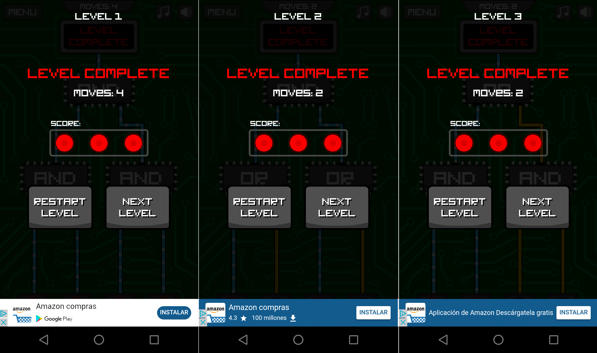

# Ejercicios propuestos (4 BitPoints)

Para completar este tutorial, se proponen los **siguientes ejercicios**:

* **Ejercicio 1**: Instalar la APP [Circuit Scramble](https://play.google.com/store/apps/details?id=com.Suborbital.CircuitScramble&hl=es_419) en una tablet o un móvil y pasar el **nivel 1**. Entregar pantallazo con el nivel resuelto.  **Valor**: 1 BitPoint

* **Ejercicio 2**: Pasar los **niveles 2** y **3** del Circuit Scramble. Enviar pantallazo con sus soluciones. **Valor**: 1 BitPoint

* **Ejercicio 3**: Entregar los ejercicios 1 y 2 (adicionalmente) a través del [repo de entregas del github](https://github.com/Obijuan/Entregas-Tutorial-Electronica-Digital-FPGAs) (haciendo un pull-request). **Valor**: 1 BitPoint por cada ejercicio (Máximo: 2 BitPoints)

***

***

<blockquote class="twitter-tweet" data-lang="es">
Me siento como cuando te quedas 😴 durmiendo a primera ⏰ hora y llegas pasado el recreo ... <a href="https://twitter.com/hashtag/TocToc?src=hash&amp;ref_src=twsrc%5Etfw">#TocToc</a> ¿Se puede?<a href="https://twitter.com/Obijuan_cube?ref_src=twsrc%5Etfw">@Obijuan_cube</a> <a href="https://twitter.com/hashtag/FPGAwars?src=hash&amp;ref_src=twsrc%5Etfw">#FPGAwars</a> <a href="https://t.co/Urp7FlZJL4">pic.twitter.com/Urp7FlZJL4</a>
&mdash; Migue (@migueabellan) <a href="https://twitter.com/migueabellan/status/950446415804882944?ref_src=twsrc%5Etfw">8 de enero de 2018</a></blockquote>
