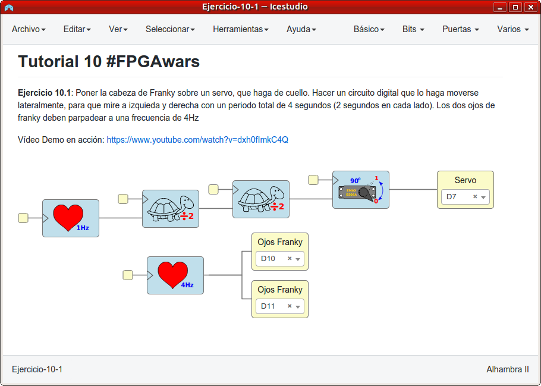
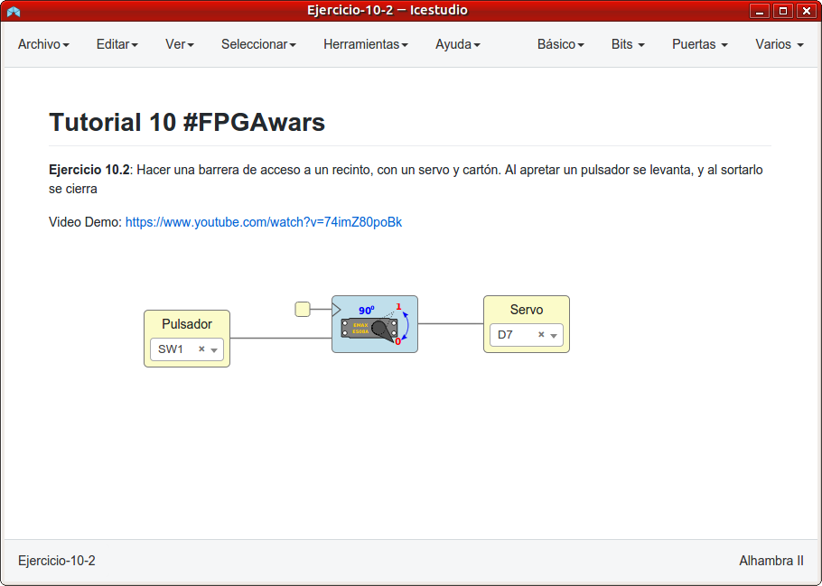
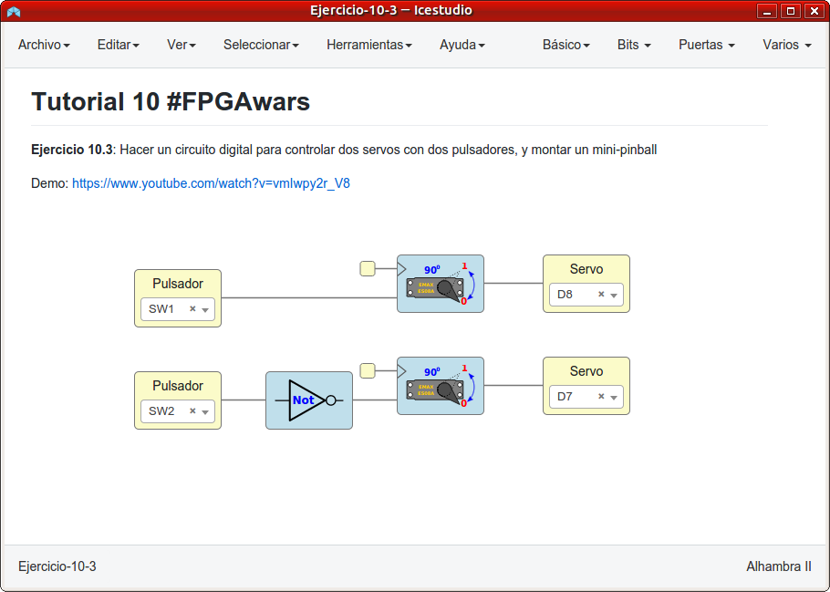
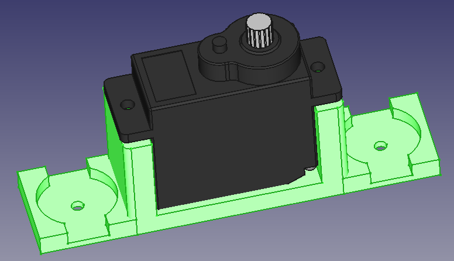
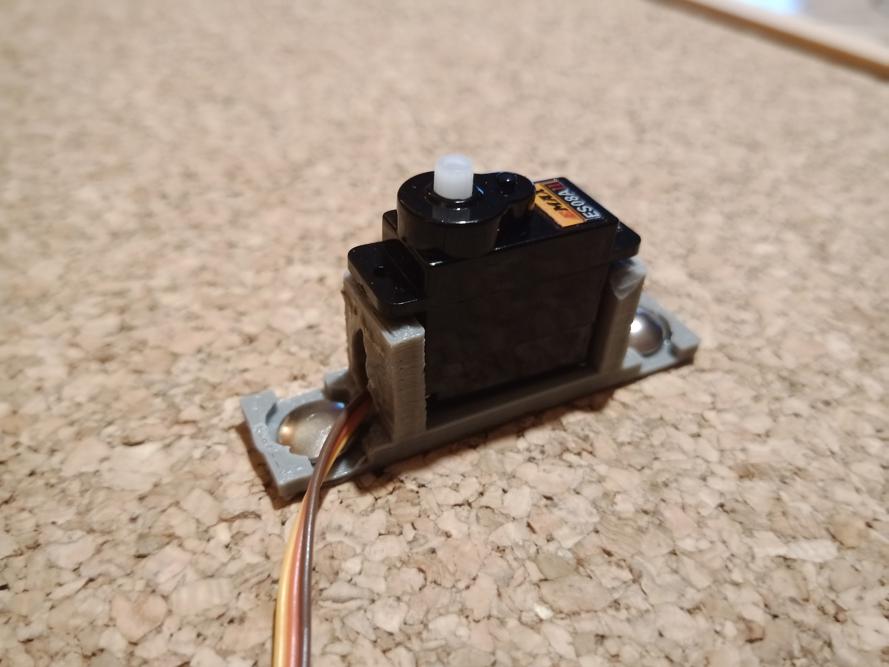
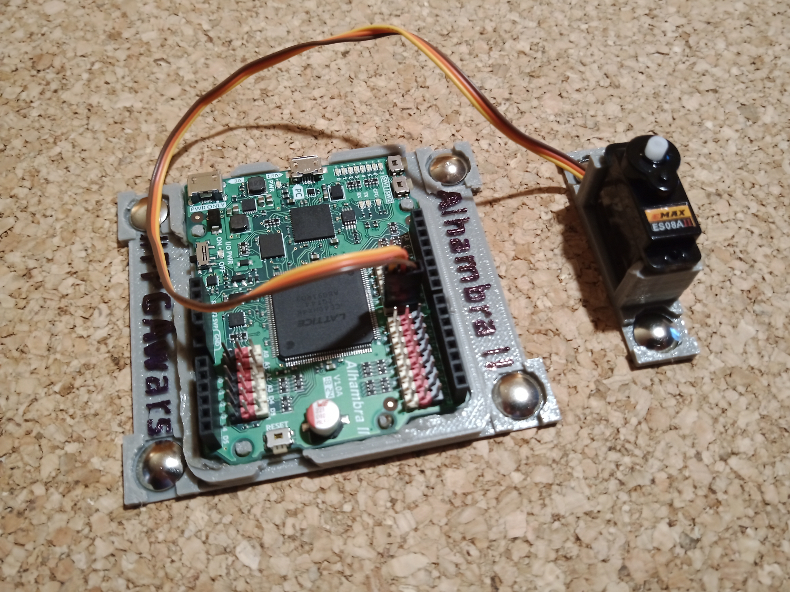
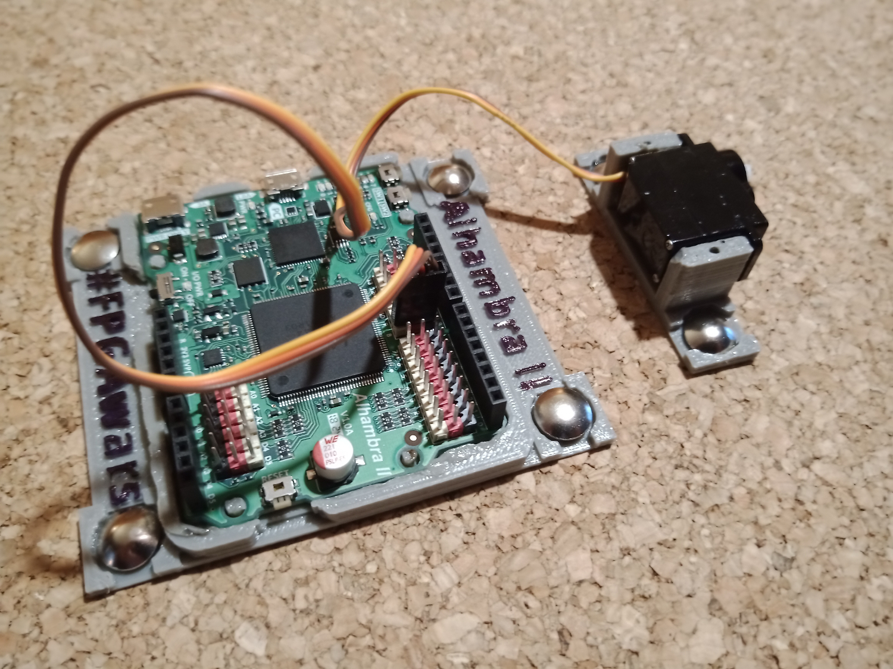
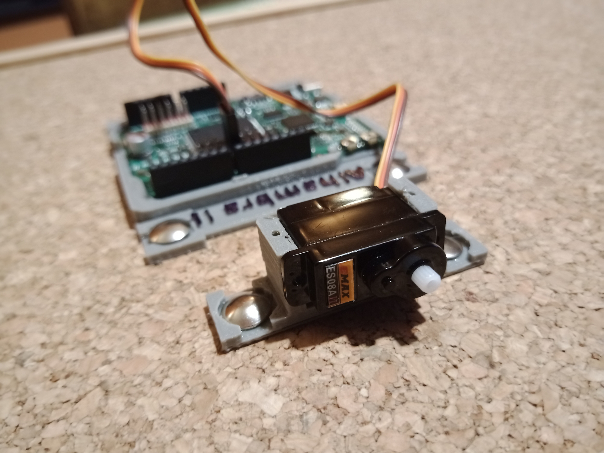
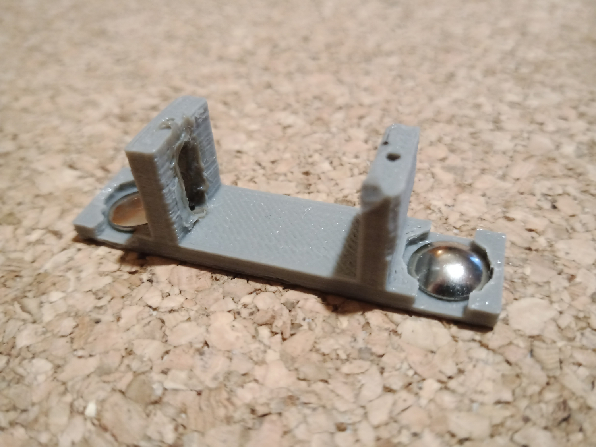

# Ejercicios propuestos del tutorial 10 #FPGAwars

Aquí dejo los ejercicios del tutorial 10.

---

* **Ejercicio 1**: Poner la cabeza de Franky sobre un servo, que haga de cuello. Hacer un circuito digital que lo haga moverse lateralmente, para que mire a izquieda y derecha con un periodo total de 4 segundos (2 segundos en cada lado). Los dos ojos de franky deben parpadear a una frecuencia de 4Hz.
 

| Circuito de Icestudio | Vídeo del diseño |
|--|--|
| |  |

---

* **Ejercicio 2**: Hacer una barrera de acceso a un recinto, con un servo y cartón. Al apretar un pulsador se levanta, y al sortarlo se cierra.
 

| Circuito de Icestudio | Vídeo del diseño |
|--|--|
| |  |

---

* **Ejercicio 3**: Hacer un circuito digital para controlar dos servos con dos pulsadores, y montar un mini-pinball.
 

| Circuito de Icestudio | Vídeo del diseño |
|--|--|
| |  |

---

* **Ejercicio 4**: Ejercicio libre: Soporte para un servo.

He decidido realizar un soporte para un servo del tipo Emax ES08A. El soporte lo he hecho en FreeCAD y [lo he dejado en esta carpeta](./Soporte_Servo_Emax-es08A.fcstd) (también he dejado [un fichero stl del soporte](./Soporte_Servo_Emax-es08A.stl)).

 
Para poder sacar el cable del servo, he hecho un agujero con un soldador, ya que se me olvidó dejar el agujero en el modelo. Algunas imágenes de cómo queda las dejo a continuación.

 

| Fotos del soporte | Fotos del soporte |
| -- | -- |
| | |
| | |
| | |

 

---

By [@luisenberlin](http://twitter.com/luisenberlin)

