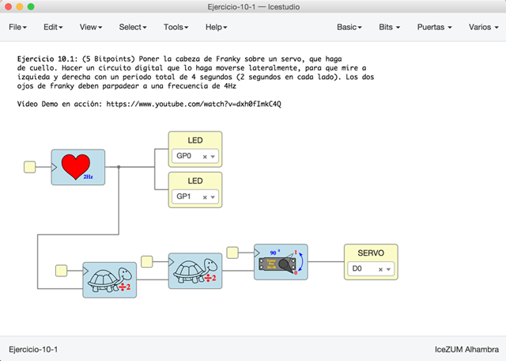
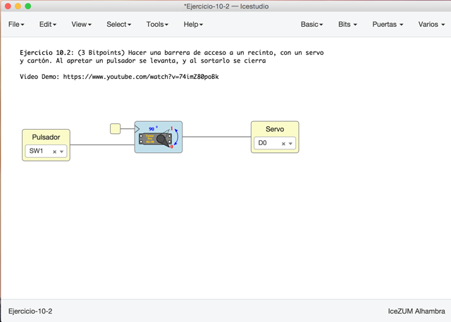
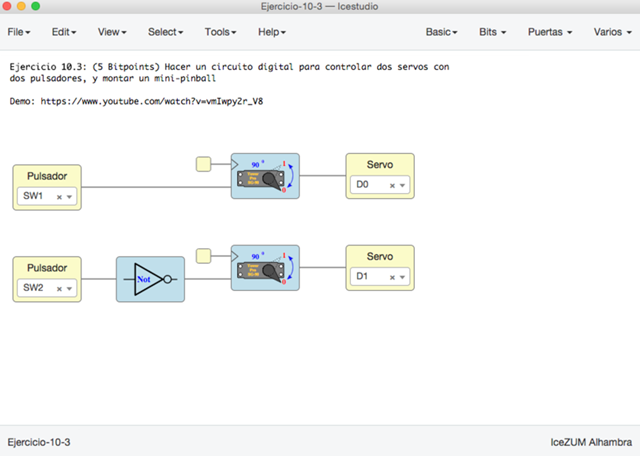

# Ejercicios propuestos (16 BitPoints)

Ver los detalles de los ejercicios y las **entregas** en el menú **Archivos/Ejemplos/2-Ejercicios** de la colección de este tutorial

**Resumen**:

* **Ejercicio 1** (Total **5 Bitpoints**): Poner la **cabeza de Franky** sobre un **servo**, que haga
de cuello. Hacer un circuito digital que lo haga moverse lateralmente, para que mire a 
izquieda y derecha con un periodo total de **4 segundos** (2 segundos en cada lado). Los dos 
ojos de franky deben parpadear a una frecuencia de **4Hz**

* **Ejercicio 2** (Total **3 Bitpoints**): Hacer una barrera de acceso a un recinto, con un servo
y cartón. Al apretar un pulsador se levanta, y al sortarlo se cierra

* **Ejercicio 3** (Total **5 Bitpoints**): Hacer un circuito digital para controlar dos servos con
dos pulsadores, y montar un mini-pinball

* **Ejercicio 4** (**3 Bitpoints**). Ejercicio Libre. Premiar la creatividad. **Entregar** por redes sociales o github: Pantallazos, enlaces, vídeos, etc...

***

# Tengo huevos de sobra para jugar al pinball con una FPGA... que lo sepas! XD

***

<blockquote class="twitter-tweet" data-lang="es">
Tutorial 10 de Electrónica Digital con FPGAs libres <a href="https://twitter.com/hashtag/FPGAwars?src=hash&amp;ref_src=twsrc%5Etfw">#FPGAwars</a>  <a href="https://twitter.com/Obijuan_cube?ref_src=twsrc%5Etfw">@Obijuan_cube</a> <a href="https://t.co/pkRAjxHFDu">pic.twitter.com/pkRAjxHFDu</a>
&mdash; Migue (@migueabellan) <a href="https://twitter.com/migueabellan/status/963380550114467840?ref_src=twsrc%5Etfw">13 de febrero de 2018</a></blockquote>
