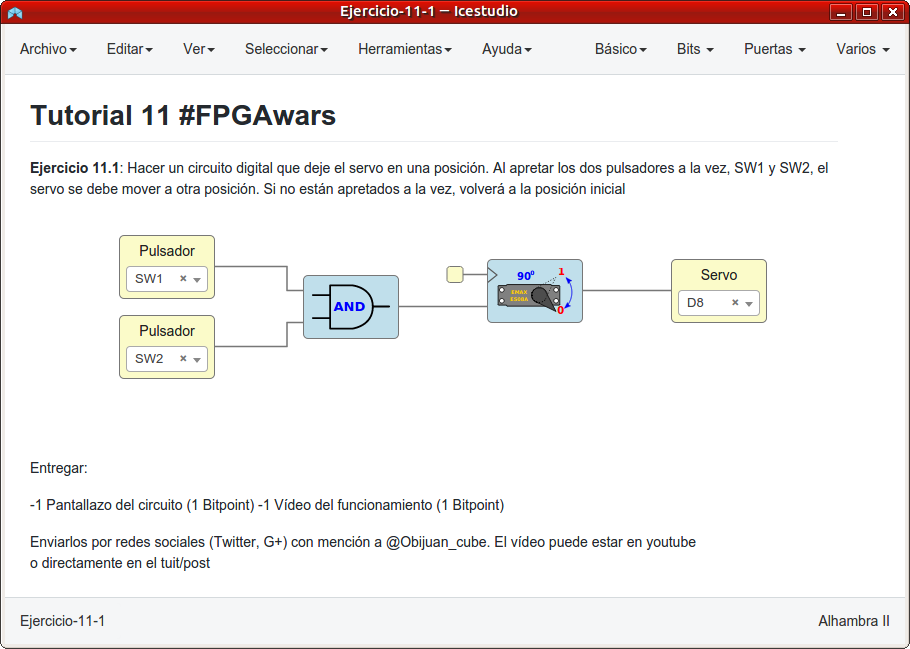
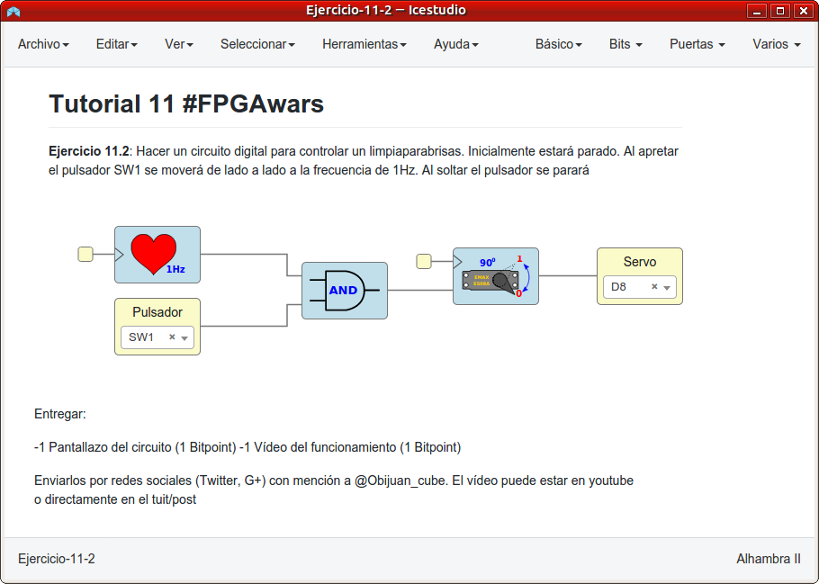
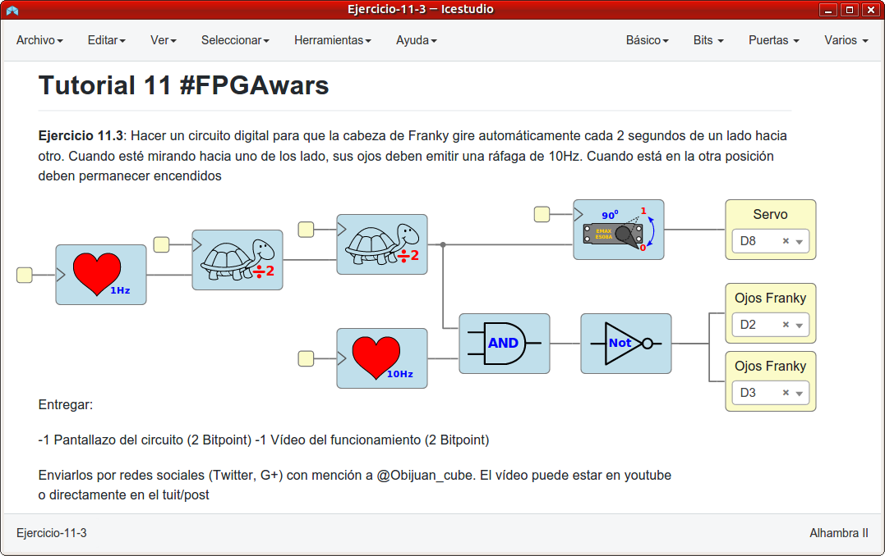
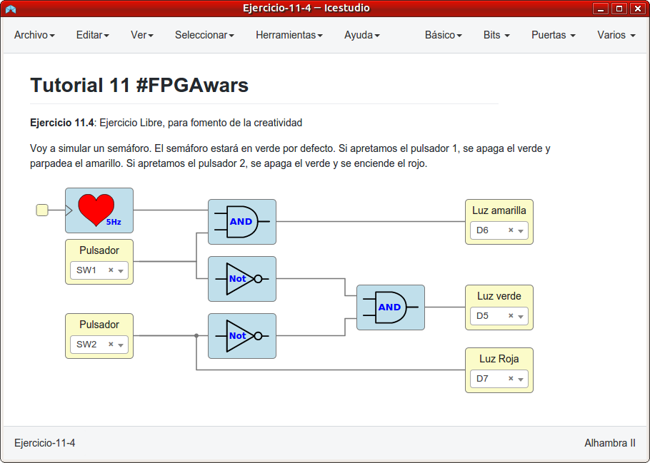

# Ejercicios propuestos del tutorial 11 #FPGAwars

Aquí dejo los ejercicios del tutorial 11.

---

* **Ejercicio 1**: Hacer un circuito digital que deje el servo en una posición. Al apretar los dos pulsadores a la vez, SW1 y SW2, el servo se debe mover a otra posición. Si no están apretados a la vez, volverá a la posición inicial.
 

| Circuito de Icestudio | Vídeo del diseño |
|--|--|
| |  |

---

* **Ejercicio 2**: Hacer un circuito digital para controlar un limpiaparabrisas de un coche. Inicialmente estará parado. Al apretar el pulsador SW1 se moverá de lado a lado a la frecuencia de 1Hz. Al soltar el pulsador se parará.
 

| Circuito de Icestudio | Vídeo del diseño |
|--|--|
| |  |

---

* **Ejercicio 3**: Hacer un circuito digital para que la cabeza de Franky gire automáticamente cada 2 segundos de un lado hacia otro. Cuando esté mirando hacia uno de los lado, sus ojos deben emitir una ráfaga de 10Hz. Cuando está en la otra posición deben permanecer encendidos.
 

| Circuito de Icestudio | Vídeo del diseño |
|--|--|
| |  |

---

* **Ejercicio 4**: Ejercicio libre: Semáforo.

Voy a simular un semáforo. El semáforo estará en verde por defecto.
Si apretamos el pulsador 1, se apaga el verde y parpadea el amarillo.
Si apretamos el pulsador 2, se apaga el verde y se enciende el rojo.

 

| Circuito de Icestudio | Vídeo del diseño |
|--|--|
| |  |

 

---

By [@luisenberlin](http://twitter.com/luisenberlin)

