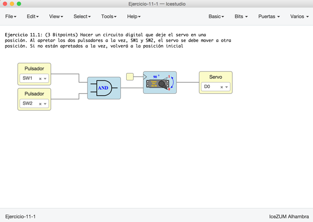
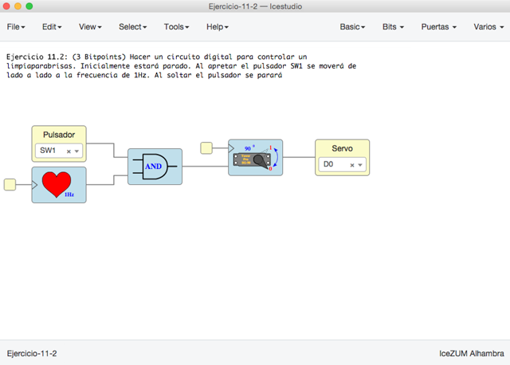
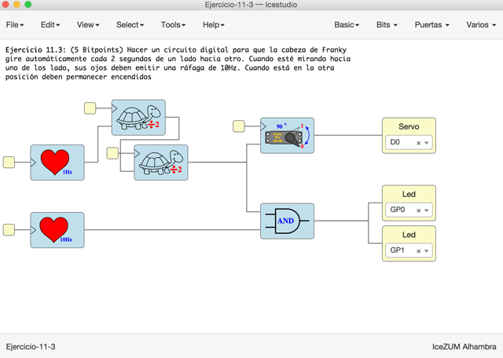
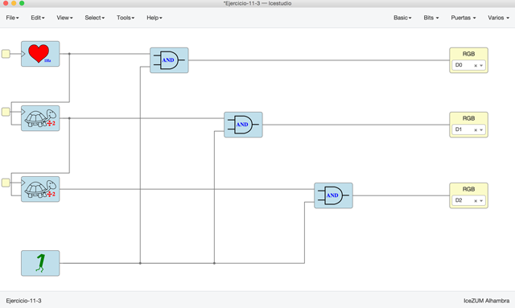

# Ejercicios propuestos (14 BitPoints)  

Ver los detalles de los ejercicios y las **entregas** en el menú **Archivos/Ejemplos/2-Ejercicios** de la colección de este tutorial  
 
**Resumen**:  

* **Ejercicio 1** (Total **3 Bitpoints**):  Hacer un circuito digital que deje el **servo** en una
posición. Al apretar **los dos pulsadores a la vez**, SW1 y SW2, el servo se debe mover a otra 
posición. Si no están apretados a la vez, volverá a la posición inicial

* **Ejercicio 2** (Total **3 Bitpoints**): Hacer un circuito digital para controlar un 
**limpiaparabrisas** de un coche. Inicialmente estará parado. Al apretar el pulsador SW1 se moverá de 
lado a lado a la frecuencia de **1Hz**. Al soltar el pulsador se parará

* **Ejercicio 3** (Total **5 Bitpoints**): Hacer un circuito digital para que la **cabeza de Franky**
gire automáticamente cada **2 segundos** de un lado hacia otro. Cuando esté mirando hacia 
uno de los lado, sus ojos deben emitir una **ráfaga de 10Hz**. Cuando está en la otra 
posición deben permanecer encendidos

* **Ejercicio 4** (**3 Bitpoints**). Ejercicio Libre. Premiar la creatividad. **Entregar** por redes sociales o github: Pantallazos, enlaces, vídeos, etc...

***

## Intento de RGB de cátodo común... Algún día Obijuan me enseñará a hacerlo :)

***

