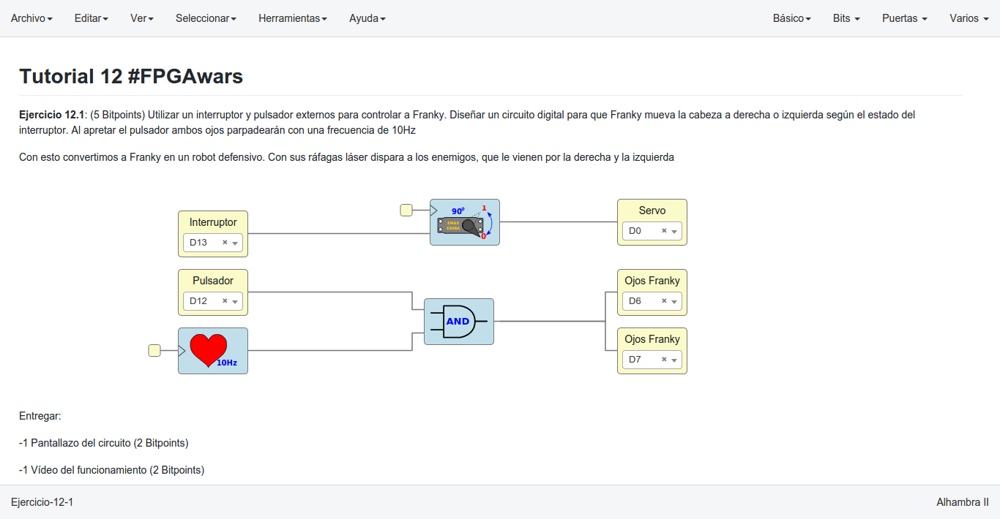
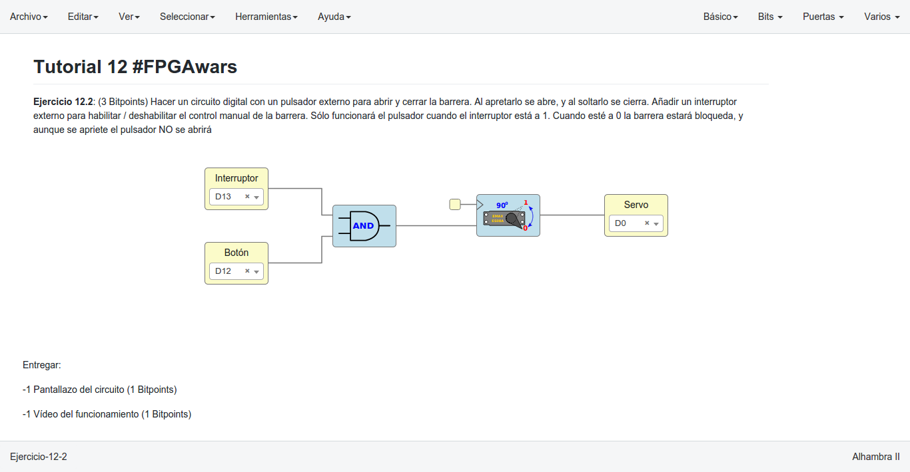
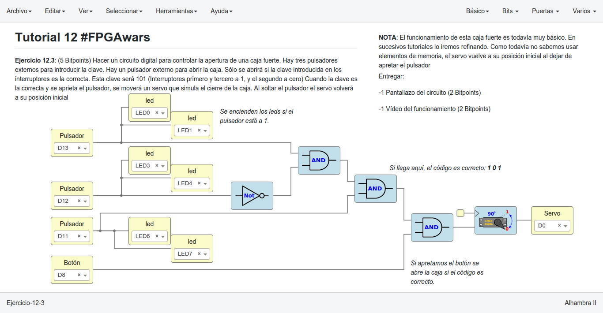
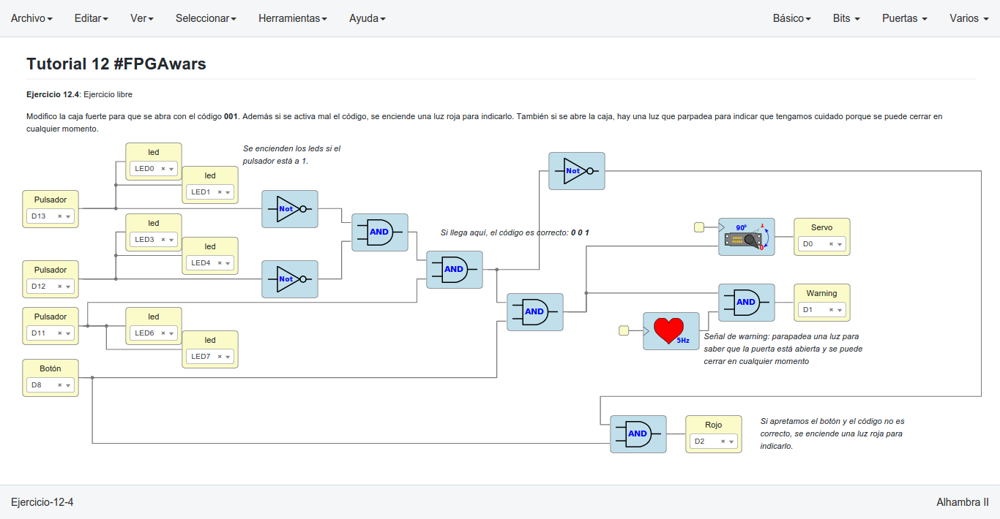

# Ejercicios propuestos del tutorial 12 #FPGAwars

Aquí dejo los ejercicios del tutorial 12.

---

* **Ejercicio 1**: Utilizar un **interruptor** y **pulsador externo** para controlar a **Franky**. Diseñar un circuito digital para que Franky mueva la cabeza a derecha o izquierda según el estado del interruptor. Al apretar el pulsador ambos ojos parpadearán con una frecuencia de **10Hz**. Con esto convertimos a Franky en un robot defensivo. Con sus ráfagas láser dispara a los enemigos, que le vienen por la derecha y la izquierda.
 

| Circuito de Icestudio | Vídeo del diseño |
|--|--|
| |  |

---

* **Ejercicio 2**: Hacer un circuito digital con un **pulsador externo** para abrir y cerrar la **barrera**. Al apretarlo se abre, y al soltarlo se cierra. Añadir un **interruptor** externo para habilitar / deshabilitar el control manual de la barrera. Sólo funcionará el pulsador cuando el interruptor está a 1. Cuando esté a 0 la barrera estará **bloqueda**, y aunque se apriete el pulsador, **NO** se abrirá.
 

| Circuito de Icestudio | Vídeo del diseño |
|--|--|
| |  |

---

* **Ejercicio 3**: Hacer un circuito digital para controlar la apertura de una **caja fuerte**. Hay **tres interruptores externos** para introducir la **clave**. Hay un pulsador externo para abrir la caja. Sólo se abrirá si la clave introducida en los interruptores es la correcta. Esta clave será **101** (Interruptores primero y tercero a 1, y el segundo a cero). Cuando la clave es la correcta y se aprieta el pulsador, se moverá un servo que simula el cierre de la caja. Al soltar el pulsador el servo volverá a su posición inicial.
 

| Circuito de Icestudio | Vídeo del diseño |
|--|--|
| |  |

---

* **Ejercicio 4**: Ejercicio libre: **Mejorando la caja fuerte**.
Modifico la caja fuerte para que se abra con el código **001**. Además si se activa mal el código, se enciende una **luz roja** para indicarlo. También si se abre la caja, hay una **luz que parpadea** para indicar que tengamos cuidado porque se puede cerrar en cualquier momento.

 

| Circuito de Icestudio | Vídeo del diseño |
|--|--|
| |  |

 

---

By [@luisenberlin](http://twitter.com/luisenberlin)

