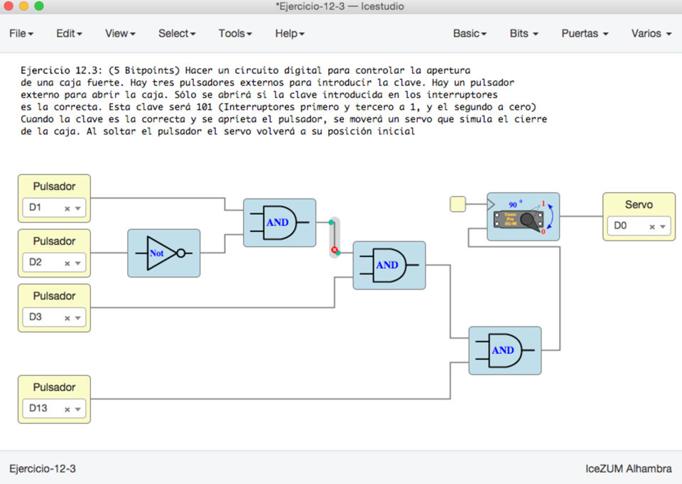

# Ejercicios propuestos (16 BitPoints)

Ver los detalles de los ejercicios y las **entregas** en el menú **Archivos/Ejemplos/2-Ejercicios** de la colección de este tutorial

**Resumen**:

* **Ejercicio 1** (Total **5 Bitpoints**): Utilizar un **interruptor** y **pulsador externos** para  controlar a **Franky**. Diseñar un circuito digital para que Franky mueva la cabeza a derecha o izquierda según el estado del interruptor. Al apretar el pulsador ambos ojos parpadearán con una frecuencia de **10Hz**. Con esto convertimos a Franky en un robot defensivo. Con sus ráfagas láser dispara a los enemigos, que le vienen por la derecha y la izquierda :-)

* **Ejercicio 2** (Total **3 Bitpoints**): Hacer un circuito digital con un **pulsador externo** para abrir y cerrar la **barrera**. Al apretarlo se abre, y al soltarlo se cierra. Añadir un **interruptor** externo para habilitar / deshabilitar el control manual de la barrera. Sólo funcionará el pulsador cuando el interruptor está a 1. Cuando esté a **0** la barrera estará **bloqueda**, y aunque se apriete el pulsador, NO se abrirá

* **Ejercicio 3** (Total **5 Bitpoints**): Hacer un circuito digital para controlar la apertura de una **caja fuerte**. Hay **tres pulsadores externos** para introducir **la clave**. Hay un pulsador externo para abrir la caja. Sólo se abrirá si la clave introducida en los interruptores es la correcta. Esta clave será **101** (Interruptores primero y tercero a 1, y el segundo a cero). Cuando la clave es la correcta y se aprieta el pulsador, se moverá un servo que simula el cierre de la caja. Al soltar el pulsador el servo volverá a su posición inicial

* **Ejercicio 4** (**3 Bitpoints**). Ejercicio Libre. Premiar la creatividad. **Entregar** por redes sociales o github: Pantallazos, enlaces, vídeos, etc...

***

***

<blockquote class="twitter-tweet" data-lang="es">
¡Entrega tutorial 12!<a href="https://twitter.com/Obijuan_cube?ref_src=twsrc%5Etfw">@Obijuan_cube</a> <a href="https://twitter.com/hashtag/FPGAwars?src=hash&amp;ref_src=twsrc%5Etfw">#FPGAwars</a> <a href="https://t.co/eH6OWwlFJS">pic.twitter.com/eH6OWwlFJS</a>
&mdash; Migue (@migueabellan) <a href="https://twitter.com/migueabellan/status/972901359472300038?ref_src=twsrc%5Etfw">11 de marzo de 2018</a></blockquote>
