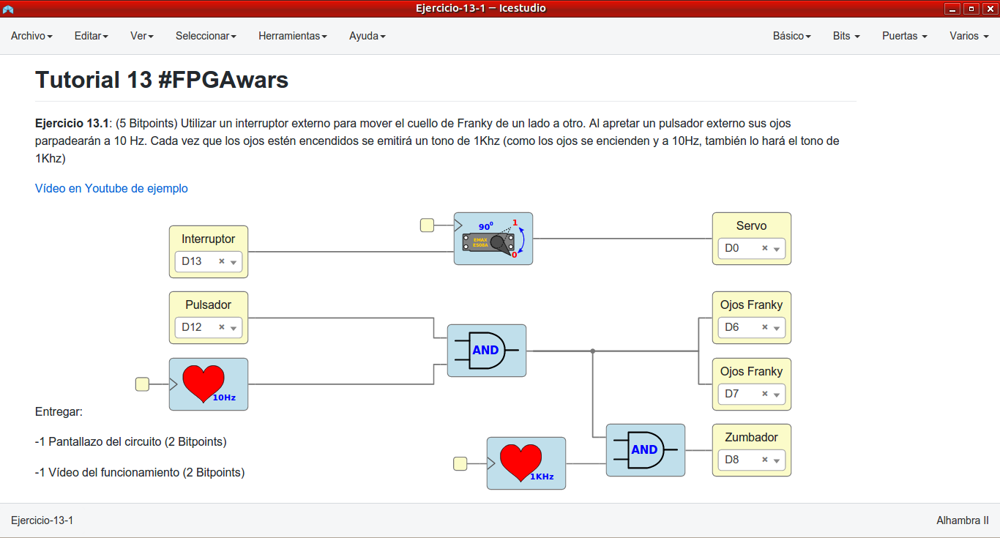
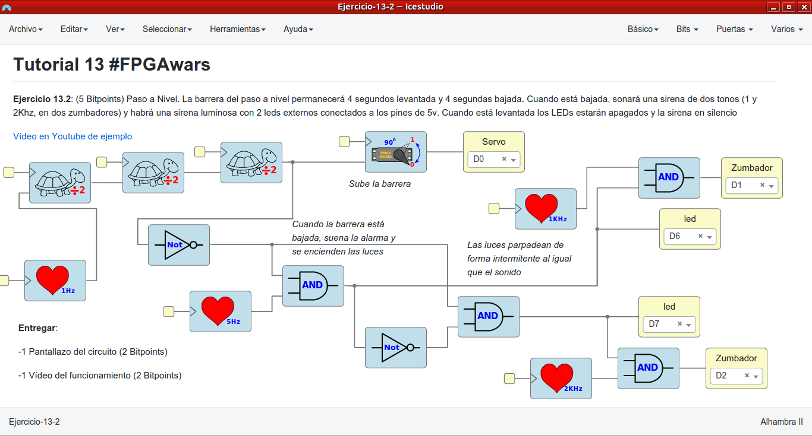
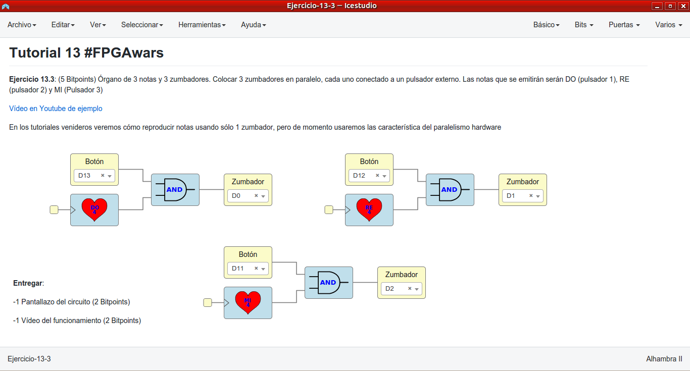
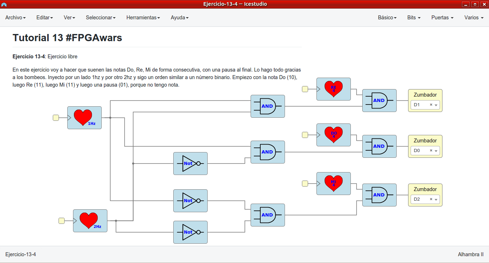

# Ejercicios propuestos del tutorial 13 #FPGAwars

Aquí dejo los ejercicios del tutorial 13.

---

* **Ejercicio 1**: Utilizar un interruptor externo para mover el cuello de Franky de un lado a otro. Al apretar un pulsador externo sus ojos parpadearán a 10 Hz. Cada vez que los ojos estén encendidos se emitirá un tono de 1Khz (como los ojos se encienden y a 10Hz, también lo hará el tono de 1Khz).
 

| Circuito de Icestudio | Vídeo del diseño |
|--|--|
| |  |

---

* **Ejercicio 2**: Paso a Nivel. La barrera del paso a nivel permanecerá 4 segundos levantada y 4 segundas bajada. Cuando está bajada, sonará una sirena de dos tonos (1 y 2Khz, en dos zumbadores) y habrá una sirena luminosa con 2 leds externos conectados a los pines de 5v. Cuando está levantada los LEDs estarán apagados y y la sirena en silencio.
 

| Circuito de Icestudio | Vídeo del diseño |
|--|--|
| |  |

---

* **Ejercicio 3**: Órgano de 3 notas y 3 zumbadores. Colocar 3 zumbadores en paralelo, cada uno conectado a un pulsador externo. Las notas que se emitirán serán DO (pulsador 1), RE (pulsador 2) y MI (Pulsador 3).
 

| Circuito de Icestudio | Vídeo del diseño |
|--|--|
| |  |

---

* **Ejercicio 4**: Ejercicio libre.

Suenan 3 notas consecutivas (Do, Re, Mi) y una pausa. En el diseño sólo se emplian estructuras lógicas Y y NO como si fueran números binarios. Por eso hay un bombeo de 1Hz y luego otro de 2Hz, de forma que cada nota suena 2Hz.
 

| Circuito de Icestudio | Vídeo del diseño |
|--|--|
| |  |

 

---

By [@luisenberlin](http://twitter.com/luisenberlin)

