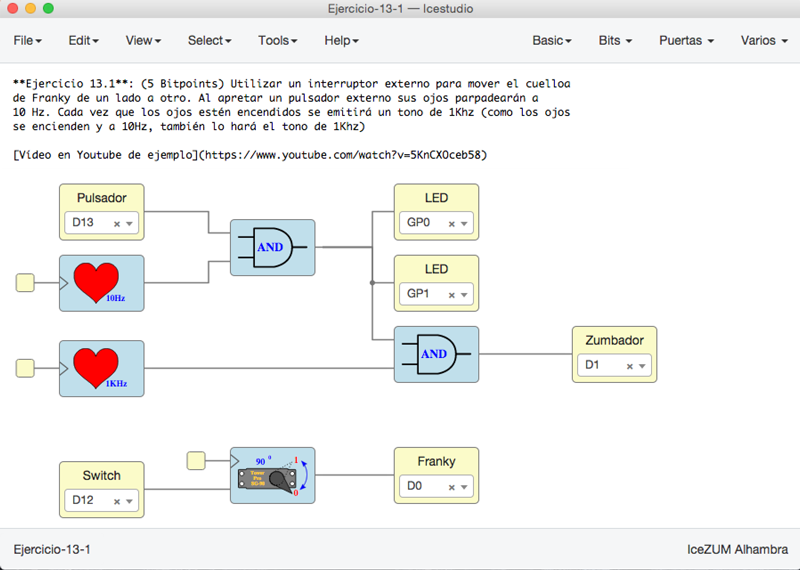
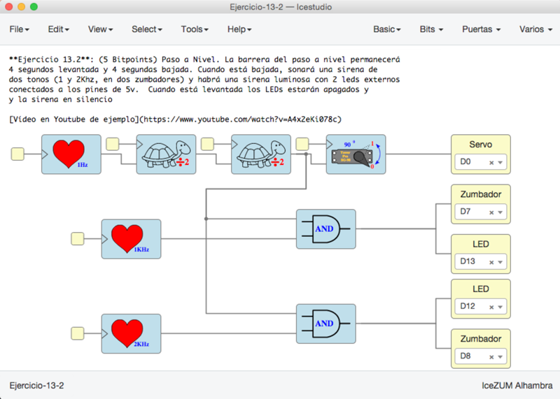
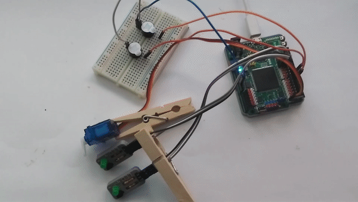
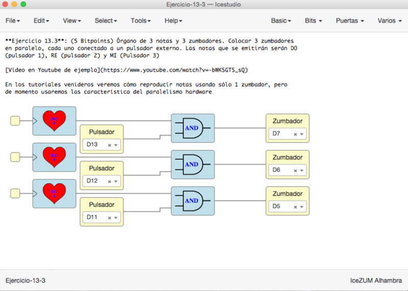
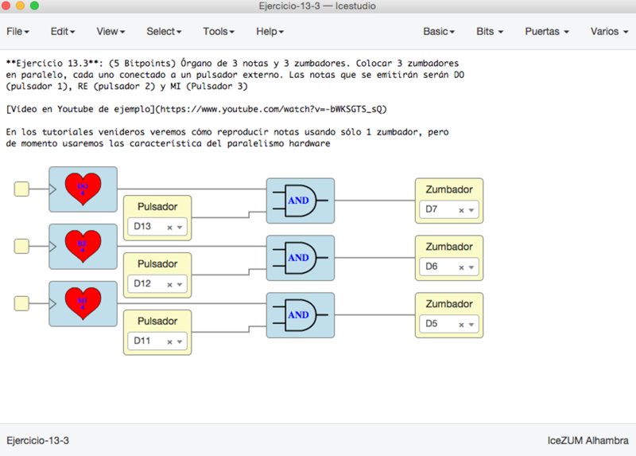

# Ejercicios propuestos (18 BitPoints)

* **Ejercicio 1** (Total **5 Bitpoints**): Utilizar un interruptor externo para mover el cuello
de Franky de un lado a otro. Al apretar un pulsador externo sus ojos parpadearán a 
10 Hz. Cada vez que los ojos estén encendidos se emitirá un tono de 1Khz (como los ojos
se encienden y a 10Hz, también lo hará el tono de 1Khz)

* **Ejercicio 2** (Total **5 Bitpoints**): Paso a Nivel. La barrera del paso a nivel permanecerá
4 segundos levantada y 4 segundas bajada. Cuando está bajada, sonará una sirena de
dos tonos (1 y 2Khz, en dos zumbadores) y habrá una sirena luminosa con 2 leds externos
conectados a los pines de 5v.  Cuando está levantada los LEDs estarán apagados y 
y la sirena en silencio

* **Ejercicio 3** (Total **5 Bitpoints**): Órgano de 3 notas y 3 zumbadores. Colocar 3 zumbadores
en paralelo, cada uno conectado a un pulsador externo. Las notas que se emitirán serán DO
(pulsador 1), RE (pulsador 2) y MI (Pulsador 3)

* **Ejercicio 4** (**3 Bitpoints**). Ejercicio Libre. Premiar la creatividad. **Entregar** por redes sociales o github: Pantallazos, enlaces, vídeos, etc...

***

***

