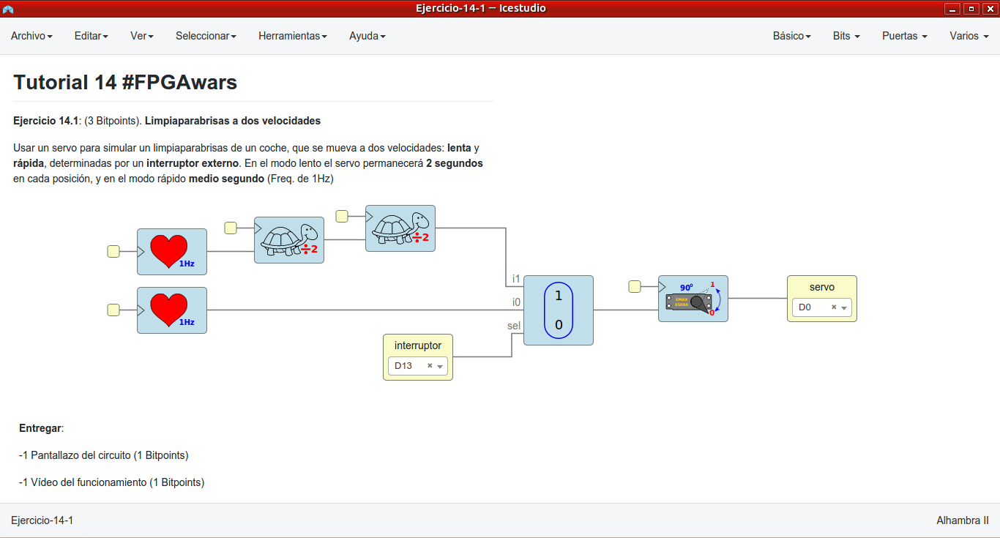
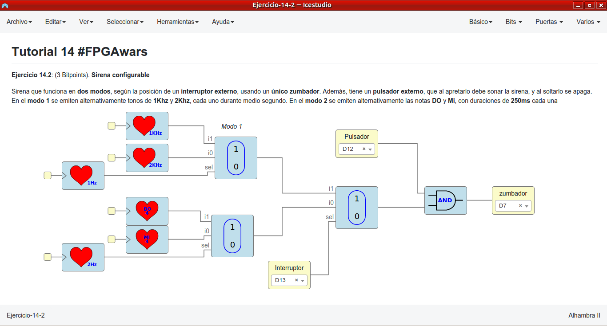
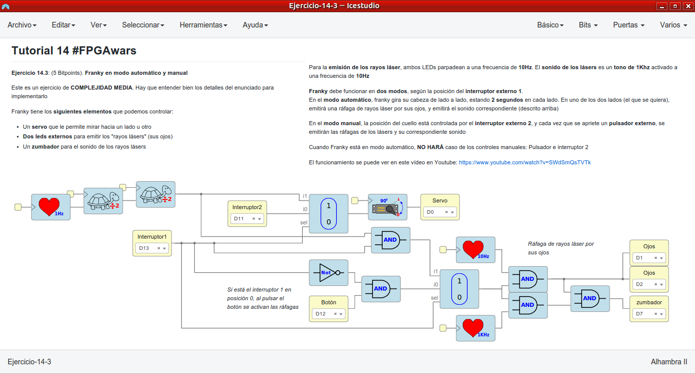
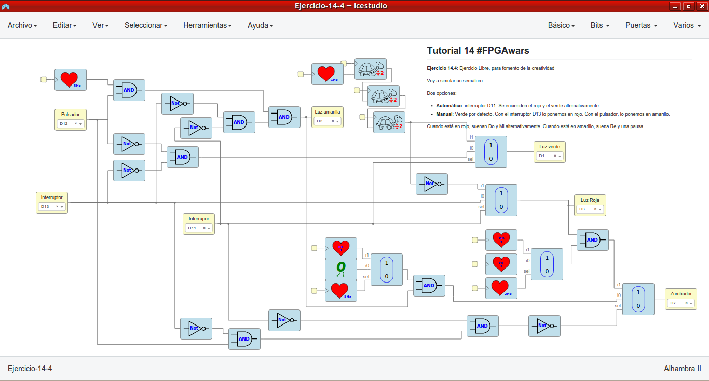

# Ejercicios propuestos del tutorial 14 #FPGAwars

Aquí dejo los ejercicios del tutorial 14.

---

* **Ejercicio 1**: Limpiaparabrisas a dos velocidades. Usar un servo para simular un limpiaparabrisas de un coche, que se mueva a dos velocidades: lenta y rápida, determinadas por un interruptor externo. En el modo lento el servo permanecerá 2 segundos en cada posición, y en el modo rápido medio segundo (Freq. de 1Hz).
 

| Circuito de Icestudio | Vídeo del diseño |
|--|--|
| |  |

---

* **Ejercicio 2**: Sirena configurable. Sirena que funciona en dos modos, según la posición de un interruptor externo, usando un único zumbador. Además, tiene un pulsador externo, que al apretarlo debe sonar la sirena, y al soltarlo se apaga. En el modo 1 se emiten alternativamente tonos de 1Khz y 2Khz, cada uno durante medio segundo. En el modo 2 se emiten alternativamente las notas DO y Mi, con duraciones de 250ms cada una..
 

| Circuito de Icestudio | Vídeo del diseño |
|--|--|
| |  |

---

* **Ejercicio 3**: Franky en modo automático y manual. Este es un ejercicio de COMPLEJIDAD MEDIA. Hay que entender bien los detalles del enunciado para implementarlo, que se encuentran en los ejercicios de esta colección. [Aquí se puede ver un vídeo de Franky funcionando](https://www.youtube.com/watch?v=SWdSmQsTVTk) en los dos modos, automático y manual.
 

| Circuito de Icestudio | Vídeo del diseño |
|--|--|
| |  |

---

* **Ejercicio 4**: Ejercicio libre.

Lo que he realizado es una simulación de un semáforo.

Tiene 2 modos controlador por un interruptor:
- Manual: Si el interrupor 1 está en 0, el semáforo está en verde. Si está en 1, se pondrá en rojo. Si pulsamos el botón, parpadea la luz amarilla.
- Automático: Se pone en rojo y verde alternativamente.

Cuando la luz está en rojo, suena un sonido (Do y Mi). Si está en amarillo suena otro sonido (Re y silencio).

 

| Circuito de Icestudio | Vídeo del diseño |
|--|--|
| |  |

 

---

By [@luisenberlin](http://twitter.com/luisenberlin)

