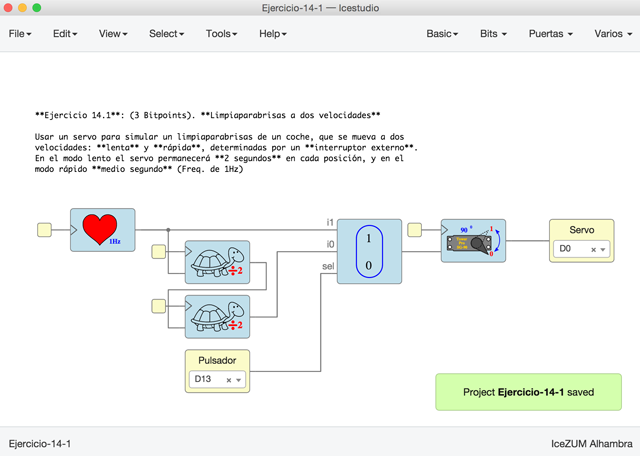
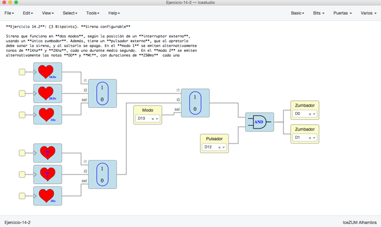
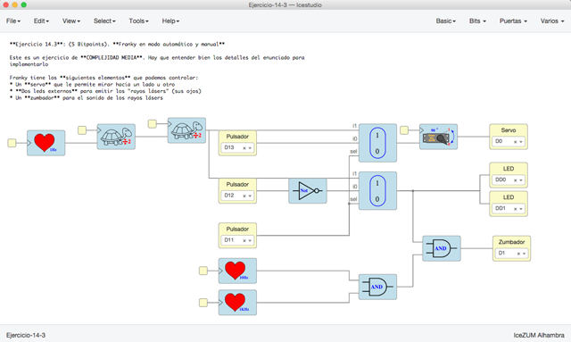
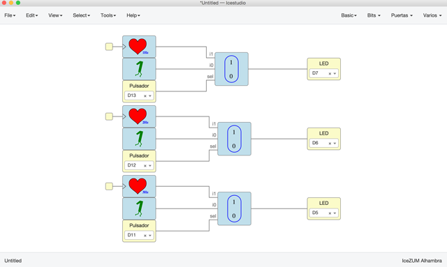

# Ejercicios propuestos (14 BitPoints)

Ver los **detalles** de los ejercicios y las **entregas** en el menú **Archivos/Ejemplos/2-Ejercicios** de la colección de este tutorial

**Resumen**:

* **Ejercicio 1** (Total **3 Bitpoints**): Limpiaparabrisas a dos velocidades. Usar un servo para simular un limpiaparabrisas de un coche, que se mueva a dos velocidades: **lenta** y **rápida**, determinadas por un **interruptor externo**. En el modo lento el servo permanecerá **2 segundos** en cada posición, y en el 
modo rápido **medio segundo** (Freq. de 1Hz)

* **Ejercicio 2** (Total **3 Bitpoints**): Sirena configurable. Sirena que funciona en **dos modos**, según la posición de un **interruptor externo**, usando un **único zumbador**. Además, tiene un **pulsador externo**, que al apretarlo debe sonar la sirena, y al soltarlo se apaga. En el **modo 1** se emiten alternativamente tonos de **1Khz** y **2Khz**, cada uno durante medio segundo.  En el **modo 2** se emiten alternativamente las notas **DO** y **Mi**, con duraciones de **250ms**  cada una.

* **Ejercicio 3** (Total **5 Bitpoints**): Franky en modo automático y manual. Este es un ejercicio de **COMPLEJIDAD MEDIA**. Hay que entender bien los detalles del enunciado para implementarlo, que se encuentran en los ejercicios de esta colección. Aquí se puede ver un **vídeo de Franky** funcionando en los dos modos, **automático** y **manual**:

* **Ejercicio 4** (**3 Bitpoints**). Ejercicio Libre. Premiar la creatividad. **Entregar** por redes sociales o github: Pantallazos, enlaces, vídeos, etc...

***

***

