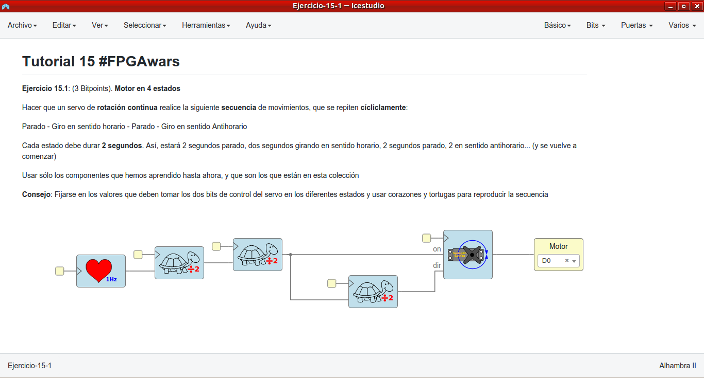
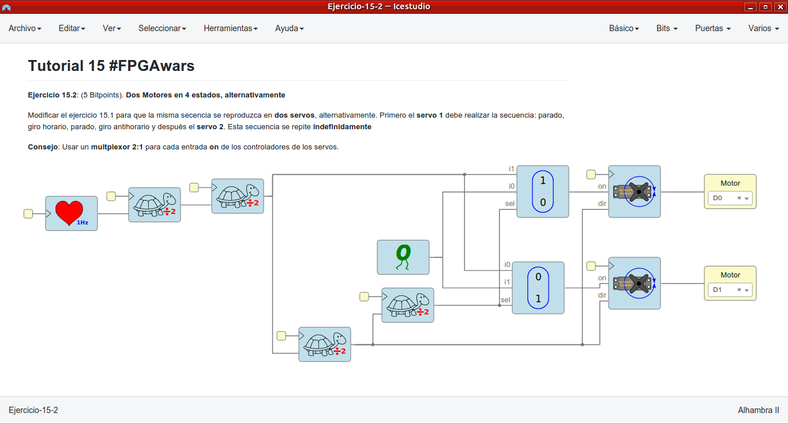
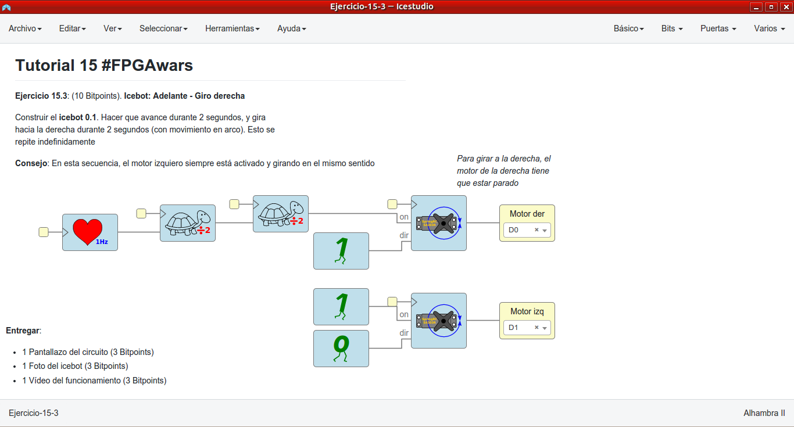
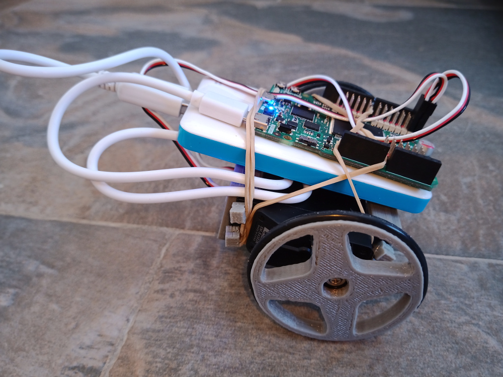
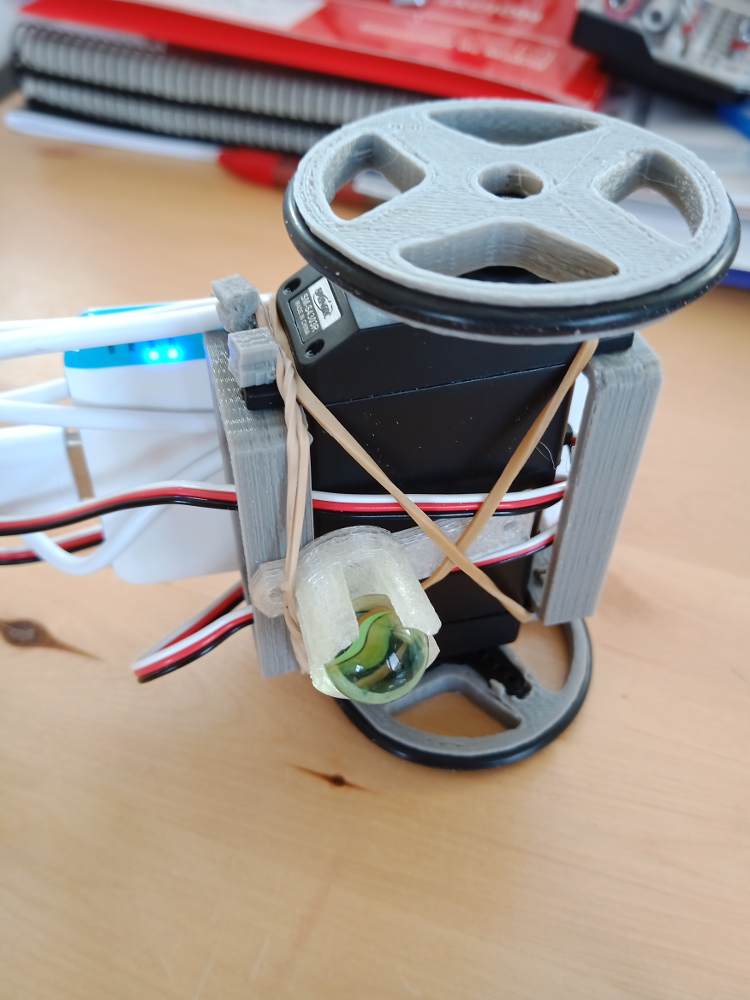
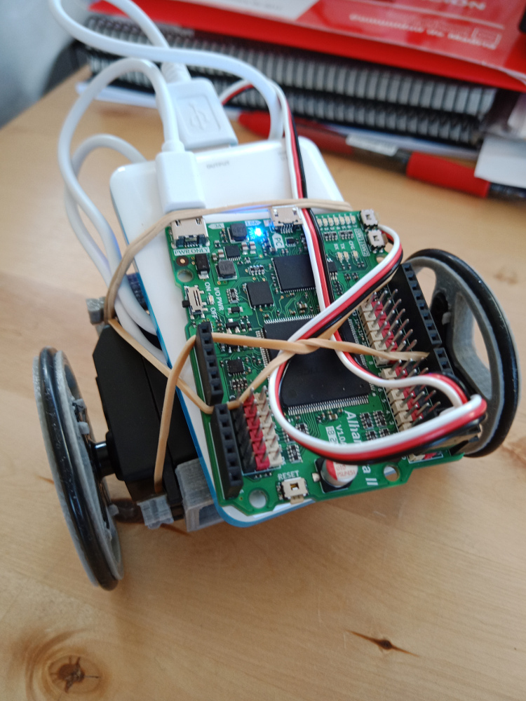
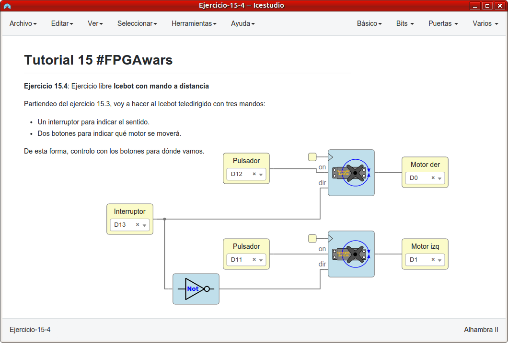
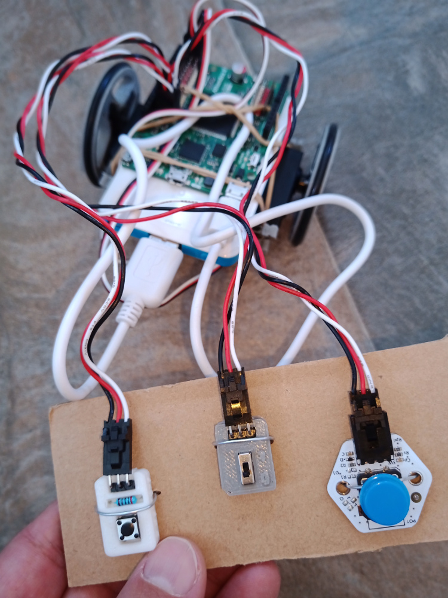

# Ejercicios propuestos del tutorial 15 #FPGAwars

Aquí dejo los ejercicios del tutorial 15.

---

* **Ejercicio 1**:   **Motor en 4 estados**

Hacer que un servo de **rotación continua** realice la siguiente **secuencia** de movimientos, que se repiten **cícliclamente**:

Parado - Giro en sentido horario - Parado - Giro en sentido Antihorario

Cada estado debe durar **2 segundos**. Así, estará 2 segundos parado, dos segundos  girando en sentido horario, 2 segundos parado, 2 en sentido antihorario... (y se vuelve a comenzar)

Usar sólo los componentes que hemos aprendido hasta ahora, y que son los que están en esta colección.
 

| Circuito de Icestudio | Vídeo del diseño |
|--|--|
| |  |

---

* **Ejercicio 2**:   **Dos Motores en 4 estados, alternativamente**

Modificar el ejercicio 15.1 para que la misma secencia se reproduzca en **dos servos**, alternativamente. Primero el **servo 1** debe realizar la secuencia:
parado, giro horario, parado, giro antihorario y después el **servo 2**. 
Esta secuencia se repite **indefinidamente**.

 

| Circuito de Icestudio | Vídeo del diseño |
|--|--|
| |  |

---

* **Ejercicio 3**:   **Icebot: Adelante - Giro derecha**

Construir el **icebot 0.1**. Hacer que avance durante 2 segundos, y gira  hacia la derecha durante 2 segundos (con movimiento en arco). Esto se  repite indefinidamente.
 

| Circuito de Icestudio | Fotos del diseño |
|--|--|
| |  |
|

 | 
 
 |
| **Vídeo del diseño** |  |

---

* **Ejercicio 4**: Ejercicio libre: **Icebot con mando a distancia**

He modificado el ejercicio 3 para añadirle un mando con dos botones y un interruptor:
- El interruptor indica si vamos hacia delante o hacia atrás.
- Los botones son para indicar qué motor quiero que se accionen.

Y además he diseñado un "mando" para controlarlo todo.

| Circuito de Icestudio | Fotos del diseño |
|--|--|
| | 

 |
| **Vídeo del diseño** |  |

 

---

By [@luisenberlin](http://twitter.com/luisenberlin)

