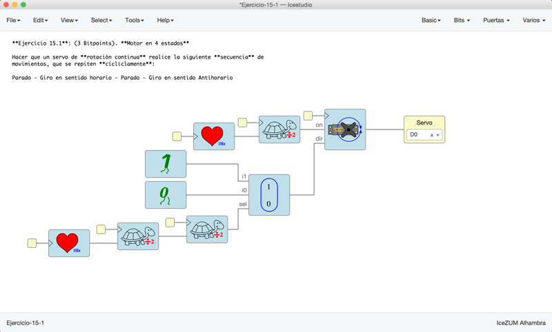
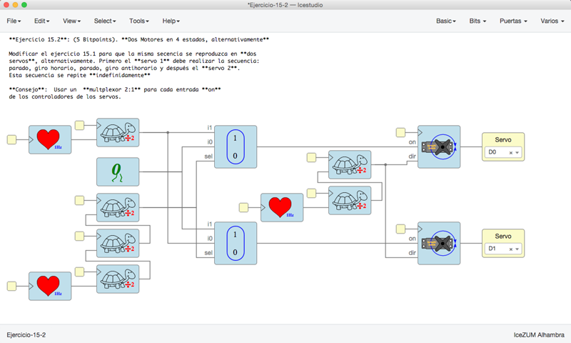
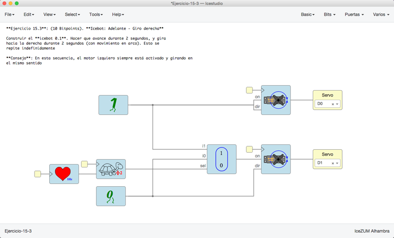
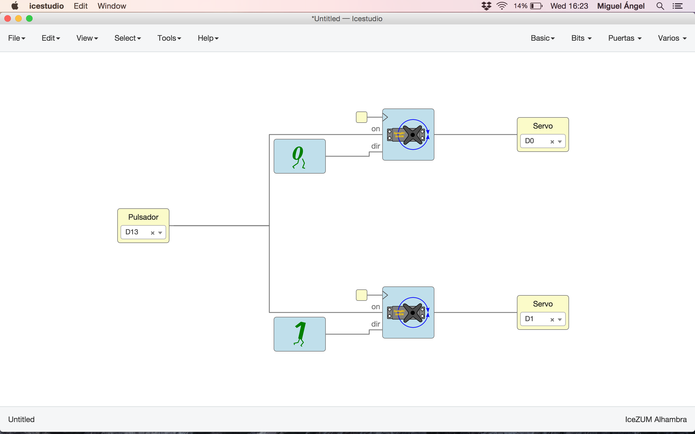

# Ejercicios propuestos (23 BitPoints)

Ver los detalles de los ejercicios y las **entregas** en el menú **Archivos/Ejemplos/2-Ejercicios** de la colección de este tutorial

**Resumen**:

* **Ejercicio 1** (Total **3 Bitpoints**): Motor en 4 estados

Hacer que un servo de **rotación continua** realice la siguiente **secuencia** de 
movimientos, que se repiten **cícliclamente**:  

Parado - Giro en sentido horario - Parado - Giro en sentido Antihorario

Cada estado debe durar **2 segundos**. Así, estará 2 segundos parado, dos segundos 
girando en sentido horario, 2 segundos parado, 2 en sentido antihorario... 
(y se vuelve a comenzar)

Usar sólo los componentes que hemos aprendido hasta ahora, y que son los que 
están en esta colección

**Consejo**: Fijarse en los valores que deben tomar los dos bits de control del servo 
en los diferentes estados y usar corazones y tortugas para reproducir la secuencia

* **Ejercicio 2** (Total **5 Bitpoints**): Dos Motores en 4 estados, alternativamente

Modificar el ejercicio 15.1 para que la misma secencia se reproduzca en **dos
servos**, alternativamente. Primero el **servo 1** debe realizar la secuencia:
parado, giro horario, parado, giro antihorario y después el **servo 2**. 
Esta secuencia se repite **indefinidamente**

**Consejo**:  Usar un  **multplexor 2:1** para cada entrada **on**
de los controladores de los servos. 

* **Ejercicio 3** (Total **10 Bitpoints**): Icebot: Adelante - Giro derecha

Construir el **icebot 0.1**. Hacer que avance durante 2 segundos, y gira  
hacia la derecha durante 2 segundos (con movimiento en arco). Esto se  
repite indefinidamente

**Consejo**: En esta secuencia, el motor izquiero siempre está activado y girando en 
el mismo sentido

* **Ejercicio 4** (**5 Bitpoints**). Ejercicio Libre. Premiar la creatividad. **Entregar** por redes sociales o github: Pantallazos, enlaces, vídeos, etc...

***

***

