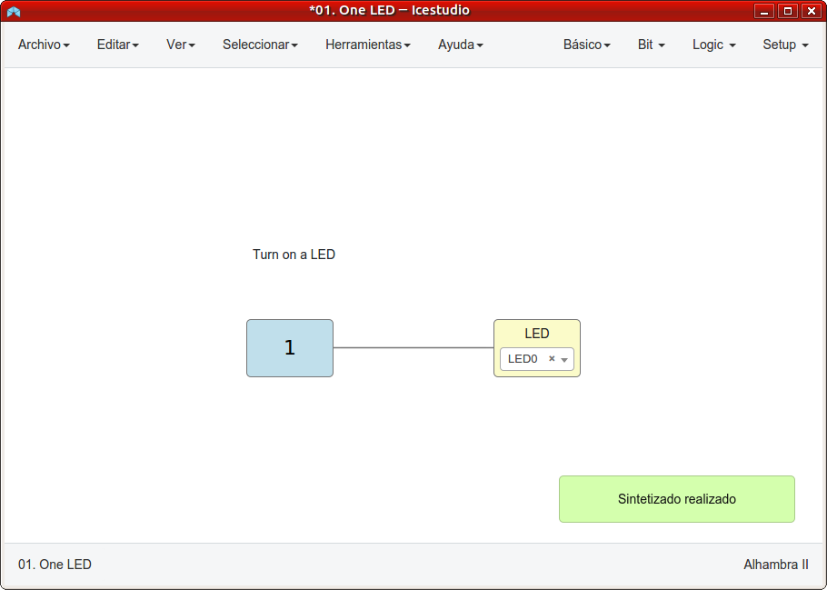
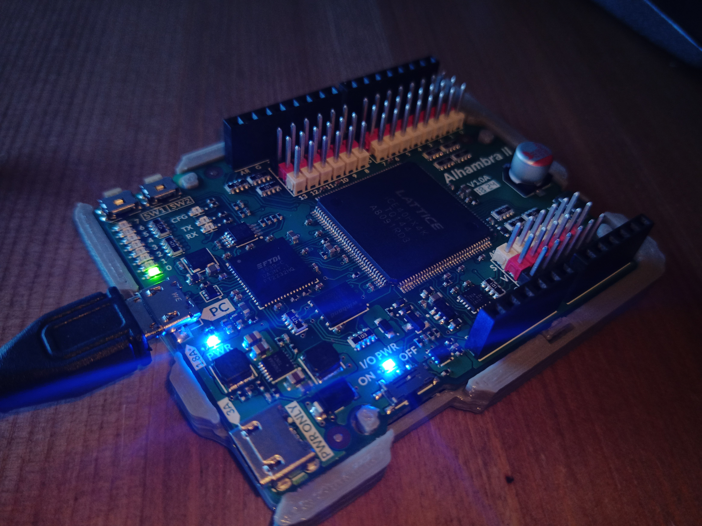

# Tutorial 2 Poniendo en marcha Icestudio #FPGAwars

Dejo aquí los ejercicios del tutorial 2, ahora que ya tengo la placa Alhambra II.

---

* **Ejercicio 1**: Sintetizado 01.LEDON

---

* **Ejercicio 2**: Prueba en la placa

Actualizado el 24/10/18

| Carga del Icestudio | Foto de la placa con el LED0 encencido |
|--|--|
|  | |

---

* **Ejercicio 3**: Subida a Github

Estos archivos demuestran la subida

---

By [@luisenberlin](http://twitter.com/luisenberlin)

