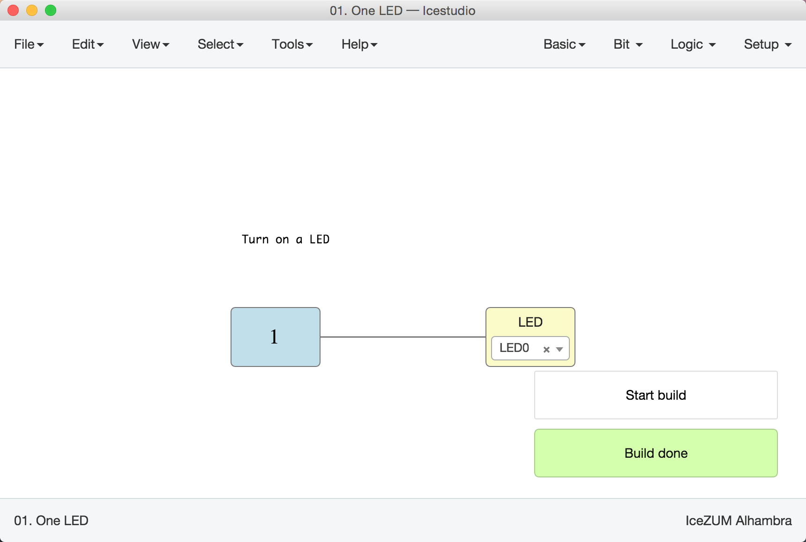
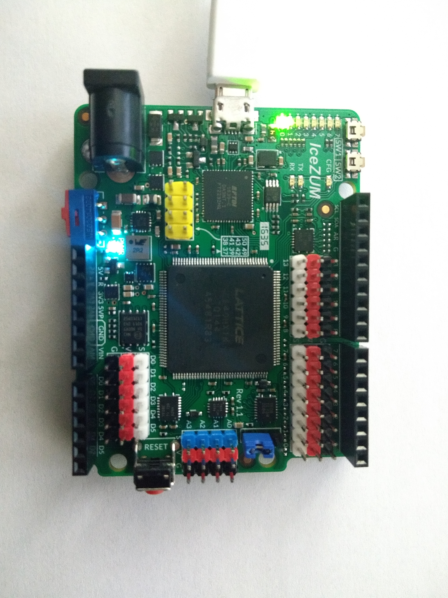

# Ejercicios propuestos (6 BitPoints)

* **Ejercicio 1**: Instalar Icestudio. Abrir el ejemplo **01.LEDON** y sintetizarlo con **Herramientas/Sintetizar**. Aunque no tengáis placa física lo podéis hacer. Enviar el pantallazo en el que aparece la notificación verde de que se ha sintetizado bien por **twitter** o **G+**, con mención a @Obijuan_cube. Valor: **1 BitPoint**

* **Ejercicio 2**: Conectar la placa y cargar el ejemplo **01.LEDON**. Enviar el pantallazo de que la carga se ha realizado correctamente y una foto de la placa con el LED0 encendido, por Twitter o G+, con mención a @Obijuan_cube. Valor: **2 Bitpoins** (uno por cada pantallazo)

* **Ejercicio 3**: Enviar los 3 pantallazos anteriores al [repositorio de entregas del Github](https://github.com/Obijuan/Entregas-Tutorial-Electronica-Digital-FPGAs/tree/master/Tutorial-2), en el directorio **Tutorial-2** y la carpeta con vuestro nombre. Valor: **3 BitPoints** (Uno por cada pantallazo)

***

***

<blockquote class="twitter-tweet" data-lang="es">
¡Tutorial 2 💪! Esto engancha... no lo probéis 🤣<a href="https://twitter.com/Obijuan_cube?ref_src=twsrc%5Etfw">@Obijuan_cube</a> <a href="https://twitter.com/hashtag/FPGAwars?src=hash&amp;ref_src=twsrc%5Etfw">#FPGAwars</a> <a href="https://t.co/DDmNre3vxn">pic.twitter.com/DDmNre3vxn</a>
&mdash; Migue (@migueabellan) <a href="https://twitter.com/migueabellan/status/950462476063297542?ref_src=twsrc%5Etfw">8 de enero de 2018</a></blockquote>
