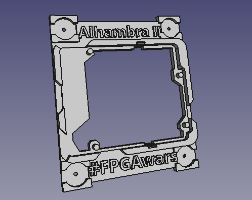

# Ejercicios propuestos del tutorial 3 #FPGAwars

Aquí dejo los ejercicios del tutorial 3.

---

* **Ejercicio 1**: Después de instalar Kicad, comparto dos pantallazos del esquema de la Alhambra.

 

| Esquema | Visor 3D|
|--|--|
| |  |

---

* **Ejercicio 2**: Ya he trasteado mucho con FreeCAD, así que comparto uno de los componentes.

 

---

* **Ejercicio 3**: He impreso 2 piezas para soporte de la Alhambra. La primera, en rojo, es la que está en el repositorio. El problema es que no me encaja bien con la Alhambra II. Así que he modificado el soporte para tener más hueco para los botones y he hecho más grande el hueco para enganchar por USB las baterías; es el de color gris que está enganchado a la placa.

 

| Dos soporte impresos | Soporte modificado para la Alhambra II|
|--|--|
| |  |

---

* **Ejercicio 4**: Ejercicio libre

He decidido hacer un soporte para la Alhambra II. He partido del que proporciona [@Obijuan_cube](http://twitter.com/Obijuan_cube) de la Alhambra I (la primera), pero la he modificado para tener el hueco de la batería externa (que es distinto al modelo original), como he contado en el ejercicio anterior, y también he cambiado el soporte para poder engancharlo con chinchetas a un corcho.

Los archivos los he subido al repositorio y son el [archivo de FreeCAD del soporte de la Alhambra II](./Soporte_Alhambra-II.fcstd) y el [stl del soporte sin texto](./Soporte-Alhambra-II_sin-texto.stl) y el [stl del soporte sin texto](./Soporte-Alhambra-II_con-texto.stl).

 

| Imagen del soporte en FreeCAD | Impresión del soporte de la Alhambra II|
|--|--|
| |  |

---

By [@luisenberlin](http://twitter.com/luisenberlin)

