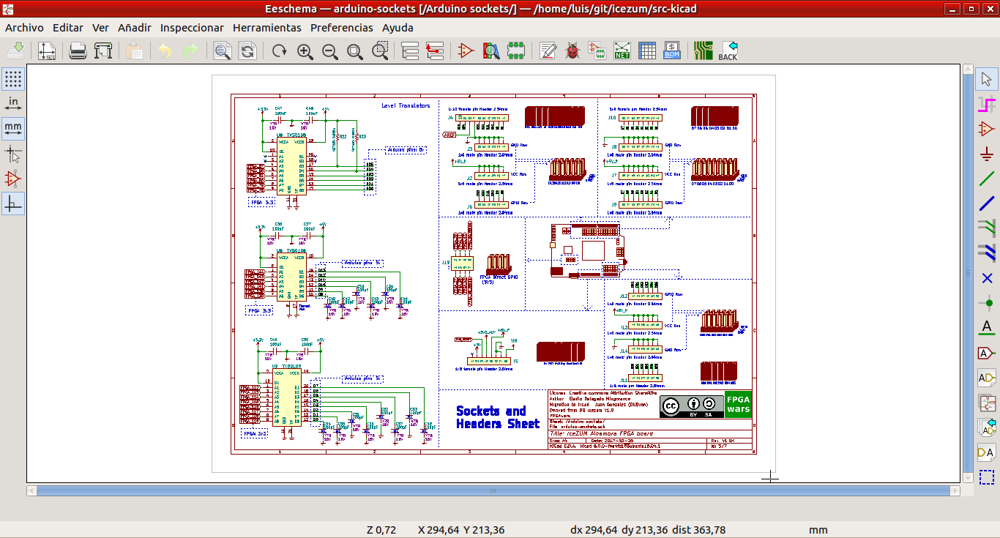
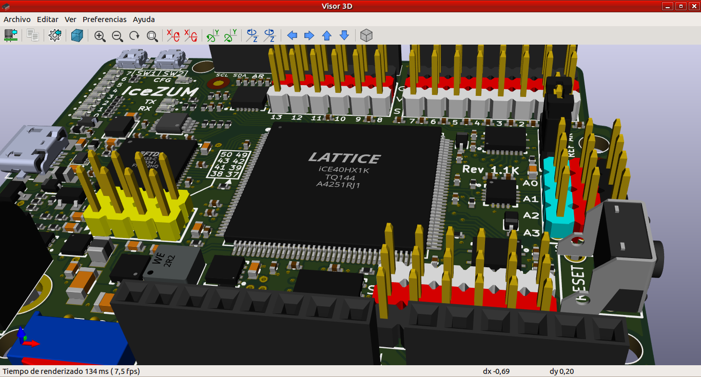
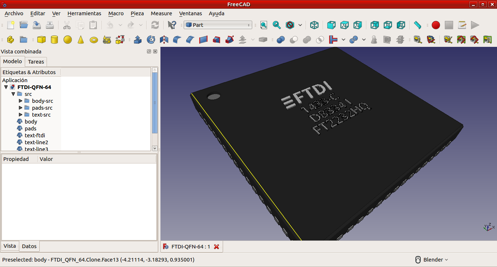
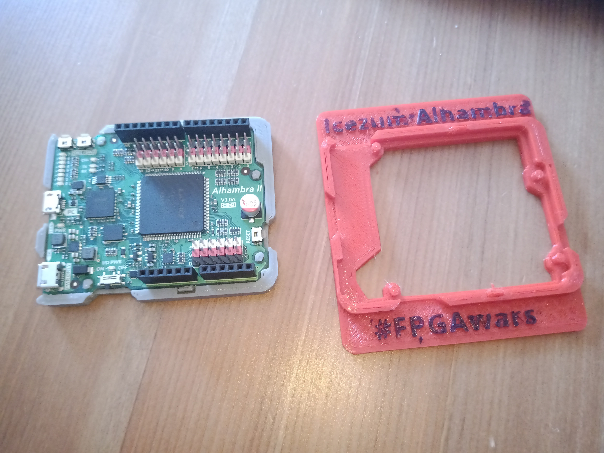
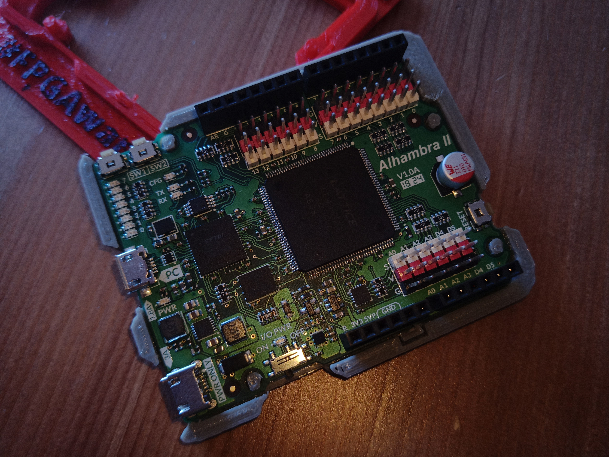

# Ejercicios propuestos del tutorial 3 #FPGAwars

Aquí dejo los ejercicios del tutorial 3.

---

* **Ejercicio 1**: Después de instalar Kicad, comparto dos pantallazos del esquema de la Alhambra.

| Esquema | Visor 3D|
|--|--|
| |  |

---

* **Ejercicio 2**: Ya he trasteado mucho con FreeCAD, así que comparto uno de los componentes.

---

* **Ejercicio 3**: He impreso 2 piezas para soporte de la Alhambra. La primera, en rojo, es la que está en el repositorio. El problema es que no me encaja bien con la Alhambra II. Así que he modificado el soporte para tener más hueco para los botones y he hecho más grande el hueco para enganchar por USB las baterías; es el de color gris que está enganchado a la placa.

| Dos soporte impresos | Soporte modificado para la Alhambra II|
|--|--|
| |  |

---

* **Ejercicio 4**: Ejercicio libre

PENDIENTE

---

By [@luisenberlin](http://twitter.com/luisenberlin)

