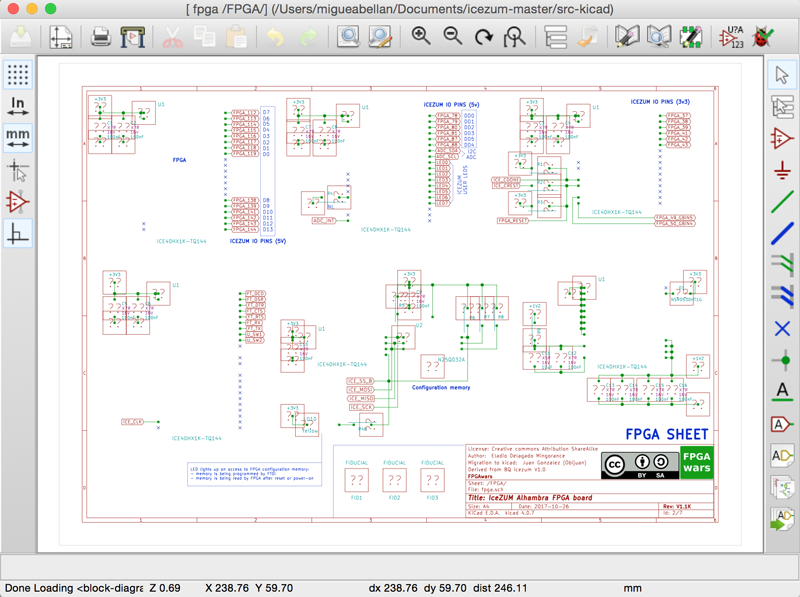

# Ejercicios propuestos (11 BitPoints)

* **Ejercicio 1** (2 Bitpoints): Instalar kicad. Bajarse el repositorio de la Icezum Alhambra y abrir el proyecto en Kicad. **Sacar dos pantallazos**, uno de una parte del esquema, y otro del PCB o del modelo 3D. Enviar las capturas por **redes sociales** (mención a @Obijuan_cube). Se concederá **1 Bitpoint adicional** por subirlas al [repositorio de entregas de github](https://github.com/Obijuan/Entregas-Tutorial-Electronica-Digital-FPGAs)

* **Ejercicio 2**:(2 Bitpoints): Instalar Freecad. Elegir un componente de la Icezum Alhambra y bajarse su archivo fuente en Freecad. Abrirlo y sacar 1 pantallazo. Enviar por **redes sociales**. Se concederá **1 Bitpoint adicional** por subirlas al [repositorio de entregas de github](https://github.com/Obijuan/Entregas-Tutorial-Electronica-Digital-FPGAs)

* **Ejercicio 3**:(2 Bitpoints): Seleccionar alguno de los accesorios 3D de la Icezum Alhambra, imprimirlo en 3D y enviar una foto por redes sociales (con mención a @Obijuan_cube). Se concederá **1 Bitpoint adicional** por subirlas al [repositorio de entregas de github](https://github.com/Obijuan/Entregas-Tutorial-Electronica-Digital-FPGAs)

* **Ejercicio 4**: (Hasta 2 Bitpoints): **Ejercicio libre**. Premiar la creatividad. Entrega por redes sociales o por github

***

***

<blockquote class="twitter-tweet" data-lang="es">
¡Remix del Tutorial 3! Lástima no tener todavía un impresora 3D ??<a href="https://twitter.com/Obijuan_cube?ref_src=twsrc%5Etfw">@Obijuan_cube</a> <a href="https://twitter.com/hashtag/FPGAwars?src=hash&amp;ref_src=twsrc%5Etfw">#FPGAwars</a> <a href="https://t.co/6ZS0esVkKG">pic.twitter.com/6ZS0esVkKG</a>
&mdash; Migue (@migueabellan) <a href="https://twitter.com/migueabellan/status/950739749404372992?ref_src=twsrc%5Etfw">9 de enero de 2018</a></blockquote>
