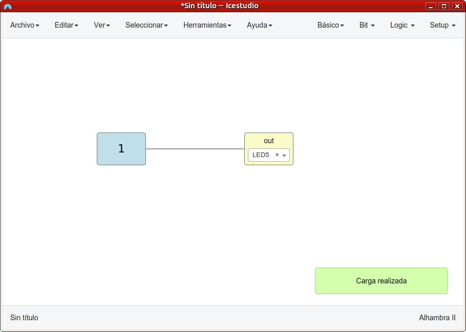
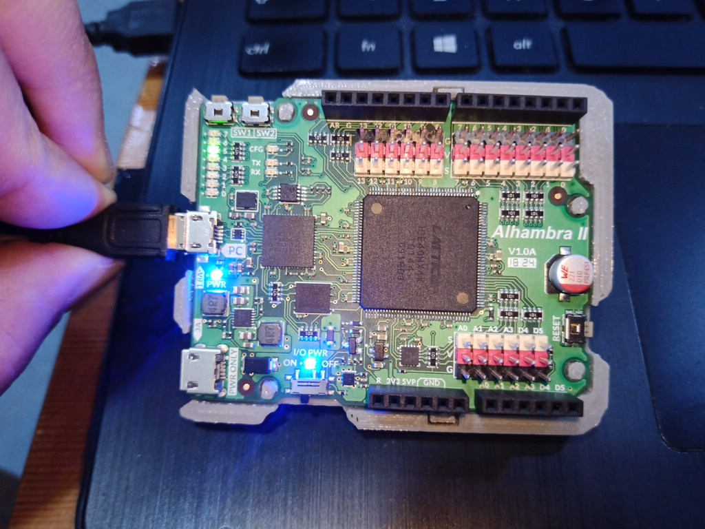
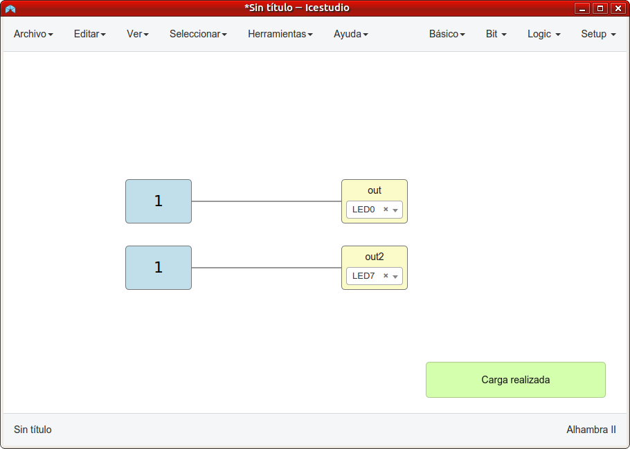
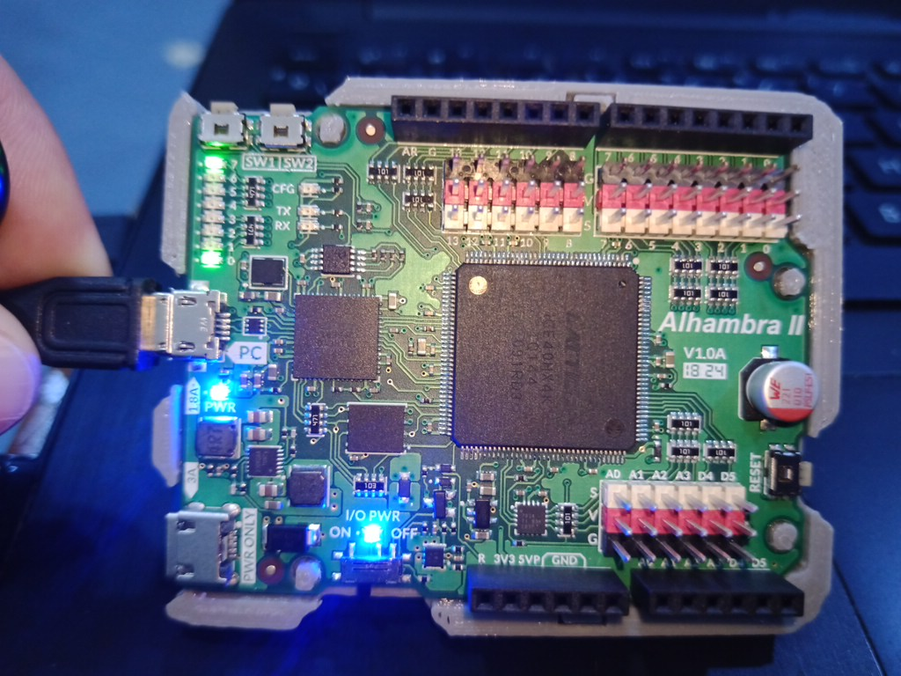
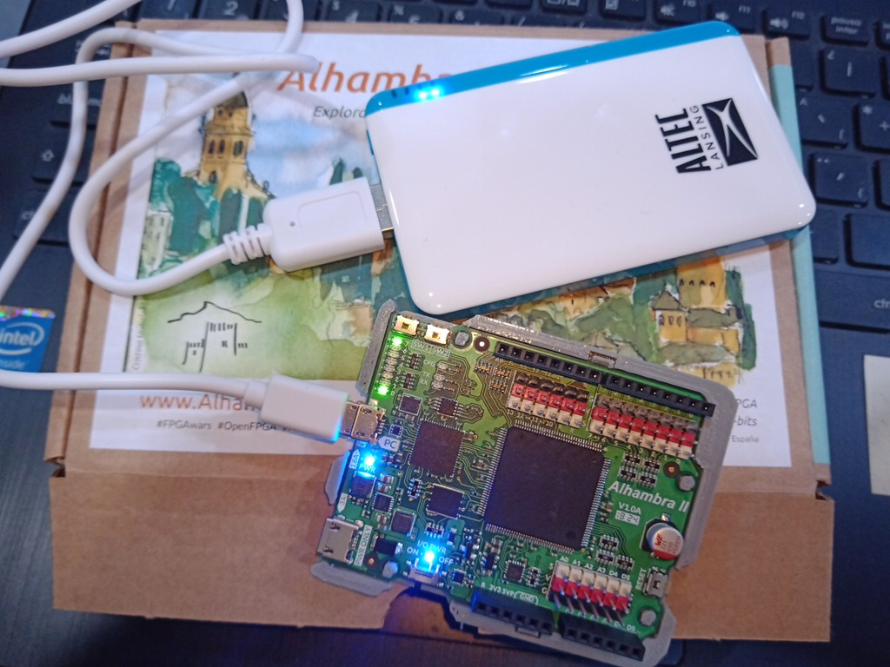

# Ejercicios propuestos del tutorial 4 #FPGAwars

Aquí dejo los ejercicios del tutorial 4.

---

* **Ejercicio 1**: Hacer un circuito que encienda el LED5.

| Circuito de Icestudio | Foto del diseño |
|--|--|
| |  |

---

* **Ejercicio 2**: Hacer un circuito que encienda los LEDs 0 y 7.

| Circuito de Icestudio | Foto del diseño |
|--|--|
| |  |

---

* **Ejercicio 3**: Conectar una pila (o power bank) para que la placa esté en modo autónomo.

---

* **Ejercicio 4**: Ejercicio libre

PENDIENTE

---

By [@luisenberlin](http://twitter.com/luisenberlin)

