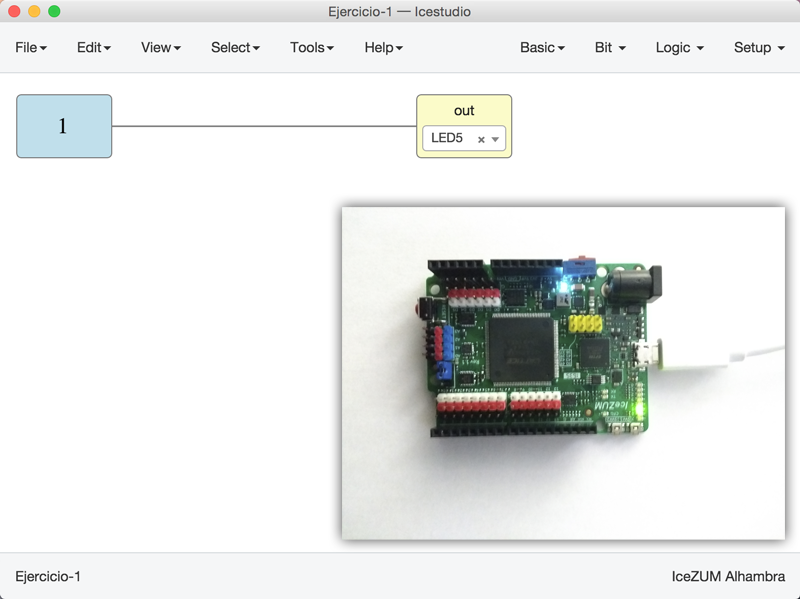
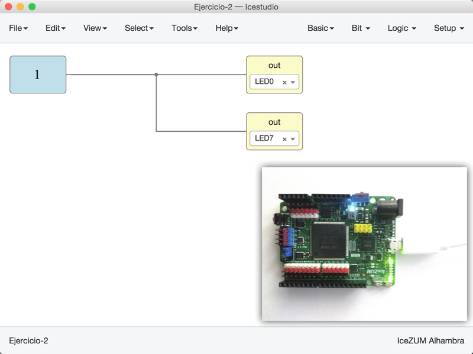
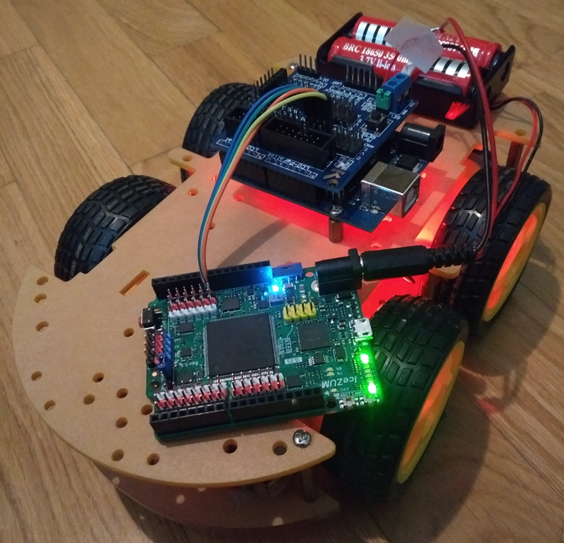

# Ejercicios propuestos (10 BitPoints)

* **Ejercicio 1** (2 Bitpoints): Hacer un circuito que encienda el **LED5**. Sacar **1 pantallazo** con el circuito en Icestudio y **una foto** de la placa con el circuito cargado. Enviar las capturas por redes sociales (mención a @Obijuan_cube). Se concederá **1 Bitpoint adicional** por subirlas al [repositorio de entregas de github](https://github.com/Obijuan/Entregas-Tutorial-Electronica-Digital-FPGAs)

* **Ejercicio 2** (2 Bitpoints): Hacer un circuito que encienda los LEDs 0 y 7. Sacar **1 pantallazo** con el circuito en Icestudio y **una foto** de la placa con el circuito cargado. Enviar las capturas por redes sociales (mención a @Obijuan_cube). Se concederá **1 Bitpoint adicional** por subirlas al [repositorio de entregas de github](https://github.com/Obijuan/Entregas-Tutorial-Electronica-Digital-FPGAs)

* **Ejercicio 3** (1 Bitpoint): Conectar una pila (o power bank) para que la placa esté en modo autónomo. Sacar **1 foto**. Enviar la captura por redes sociales (mención a @Obijuan_cube). Se concederá **1 Bitpoint adicional** por subirlas al [repositorio de entregas de github](https://github.com/Obijuan/Entregas-Tutorial-Electronica-Digital-FPGAs)

* **Ejercicio 4** (Hasta 2 Bitpoints): Ejercicio Libre. Premiar la creatividad. Entrega por redes sociales o por github 

***

***

<blockquote class="twitter-tweet" data-lang="es">
¡Tutorial 4! De momento no tira ?? ... pero ya tirará ya...<a href="https://twitter.com/Obijuan_cube?ref_src=twsrc%5Etfw">@Obijuan_cube</a> <a href="https://twitter.com/hashtag/FPGAwars?src=hash&amp;ref_src=twsrc%5Etfw">#FPGAwars</a> <a href="https://t.co/QwTCoAXv5E">pic.twitter.com/QwTCoAXv5E</a>
&mdash; Migue (@migueabellan) <a href="https://twitter.com/migueabellan/status/950768746431438848?ref_src=twsrc%5Etfw">9 de enero de 2018</a></blockquote>
