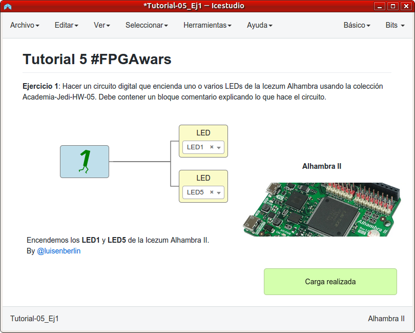
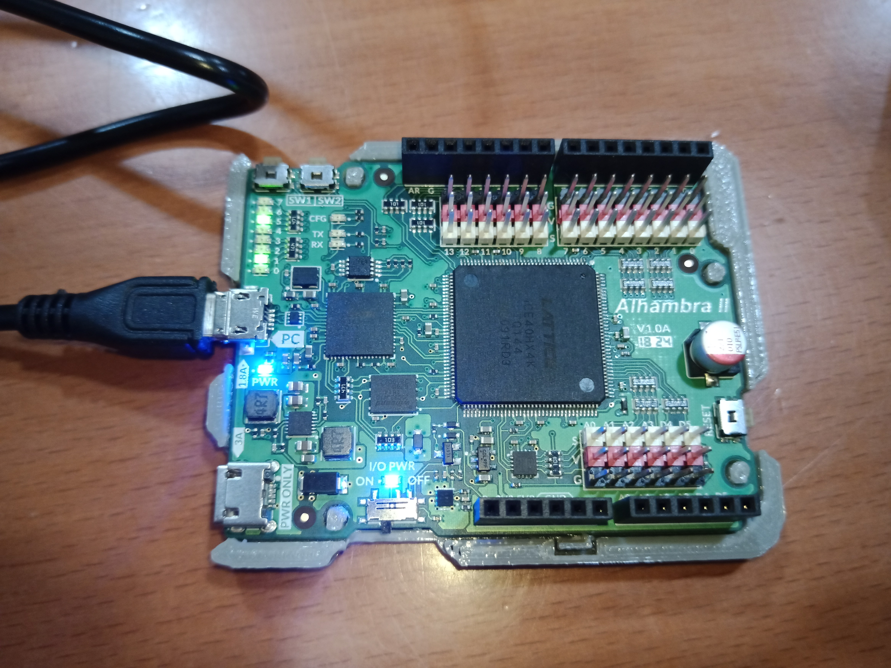
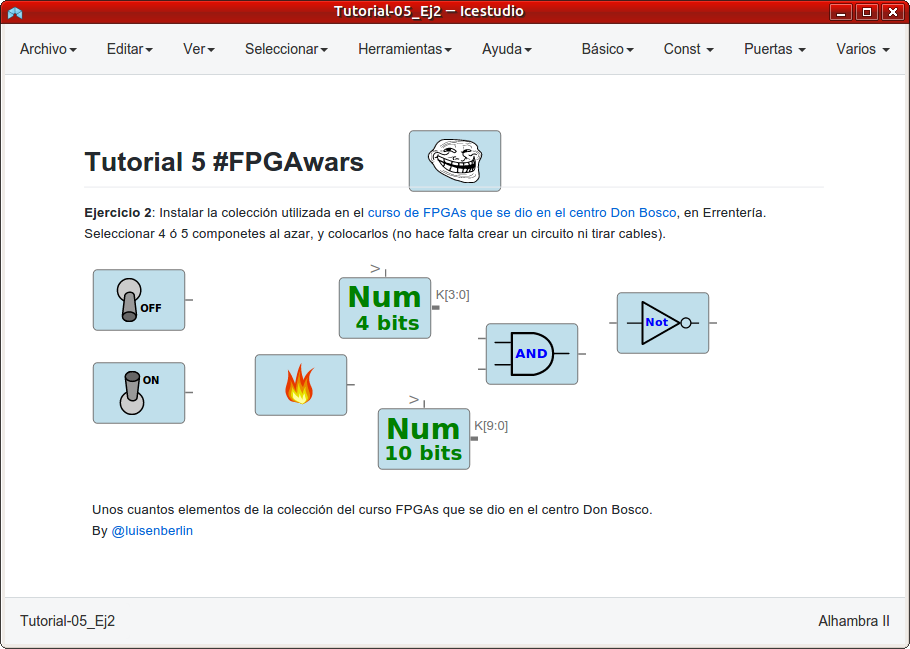
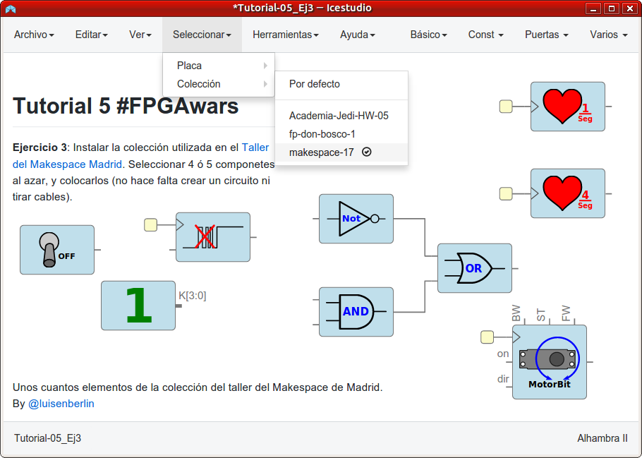
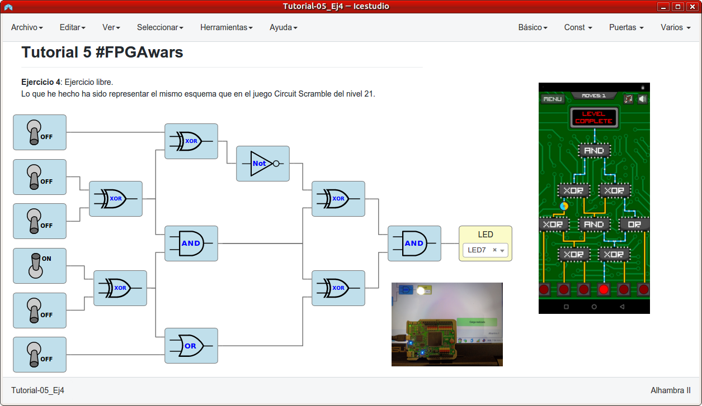
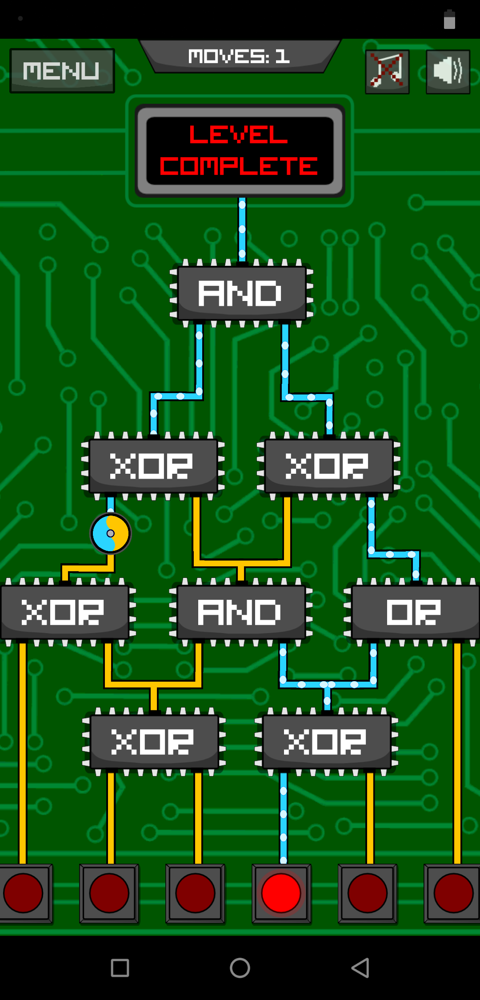

# Ejercicios propuestos del tutorial 5 #FPGAwars

Aquí dejo los ejercicios del tutorial 5.

---

* **Ejercicio 1**: Hacer un circuito digital que encienda uno o varios LEDs de la Icezum Alhambra usando la colección Academia-Jedi-HW-05. Debe contener un bloque comentario explicando lo que hace el circuito, así como vuestro nombre o nick en Negrita.

El [diseño en Icestudio es éste](./Tutorial-05_Ej1.ice).

| Circuito de Icestudio | Foto del diseño |
|--|--|
| |  |

---

* **Ejercicio 2**: Instalar la colección utilizada en el curso de FPGAs que se dio en el centro Don Bosco, en Errentería. Seleccionar 4 ó 5 componetes al azar, y colocarlos (no hace falta crear un circuito ni tirar cables).

El [diseño en Icestudio es éste](./Tutorial-05_Ej2.ice).

---

* **Ejercicio 3**: Instalar la colección utilizada en el Taller del Makespace Madrid. Seleccionar 4 ó 5 componetes al azar, y colocarlos (no hace falta crear un circuito ni tirar cables).

El [diseño en Icestudio es éste](./Tutorial-05_Ej3.ice).

---

* **Ejercicio 4**: Ejercicio libre

Represento en el Icestudio el mismo circuito que en el nivel 21 del Circuit Scramble.

El [diseño en Icestudio es éste](./Tutorial-05_Ej4.ice).

| Circuit Scramble | Foto del funcionamiento en el Alhambra II |
|--|--|
| |  |

---

By [@luisenberlin](http://twitter.com/luisenberlin)

