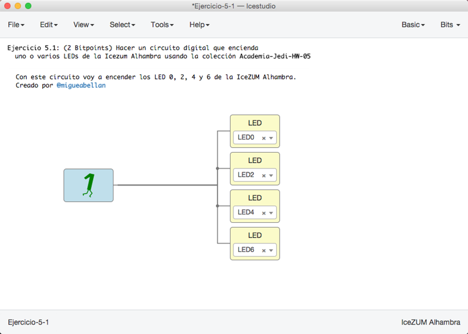
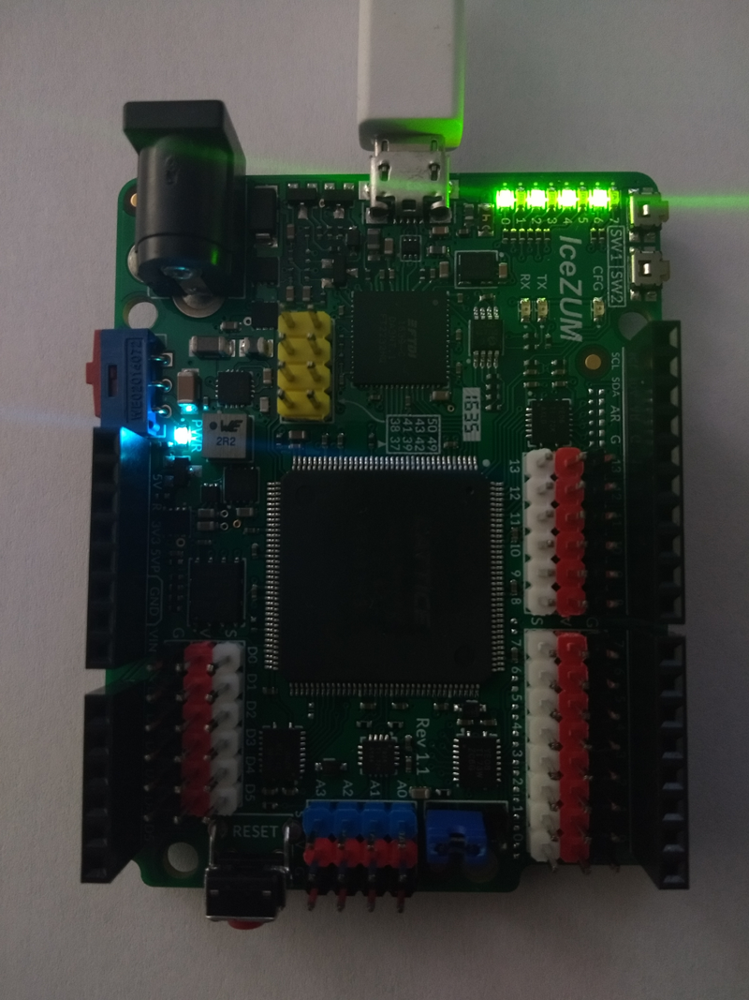
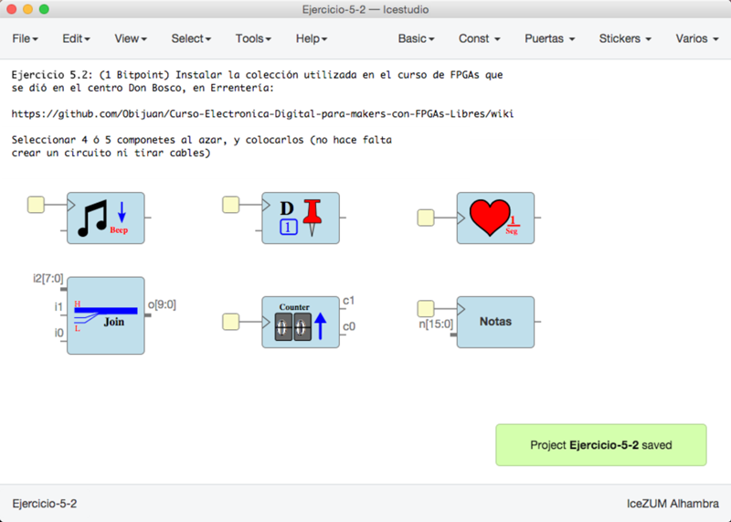
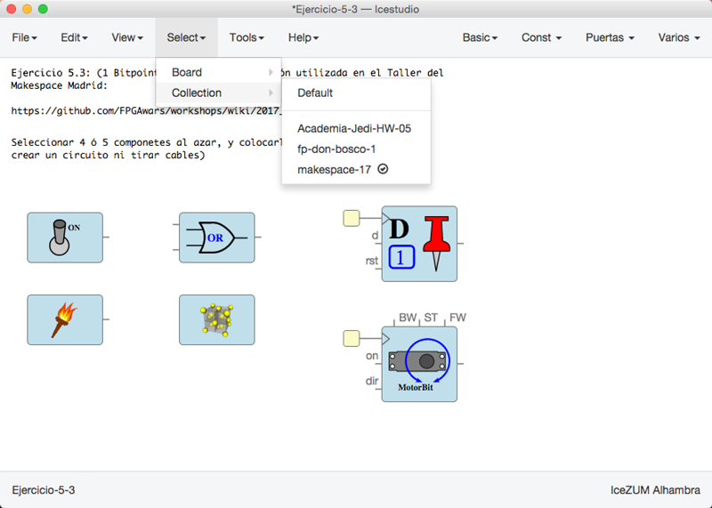

# Ejercicios propuestos (9 BitPoints)

* **Ejercicio 1** (Total **3 Bitpoints**): Hacer un circuito digital que encienda uno o varios LEDs de la Icezum Alhambra usando la colección **Academia-Jedi-HW-05**. Debe contener un **bloque comentario** explicando lo que hace el circuito, así como vuestro nombre o nick en **Negrita**. 
**Entregar** por redes sociales, con mención a **@obijuan_cube**
  * 1 pantallazo del circuito (1 bitpoint)
  * 1 Foto de la Icezum Alhambra con el circuito cargado (1 bitpoint)
  * Entrega adicional por Github (1 bitpoint) 

* **Ejercicio 2** (Total **2 Bitpoints**): Instalar la colección utilizada en el [curso de FPGAs que
se dió en el centro Don Bosco](https://github.com/Obijuan/Curso-Electronica-Digital-para-makers-con-FPGAs-Libres/wiki), en Errentería. Seleccionar 4 ó 5 componetes al azar, y colocarlos (no hace falta 
crear un circuito ni tirar cables). **Entregar** por redes sociales, con mención a **@obijuan_cube**:
  * 1 Pantallazo (1 bitpoint)
  * Entrega adicional por Github (1 bitpoint)

* **Ejercicio 3** (Total *2 Bitpoint*): Instalar la colección utilizada en el [Taller del 
Makespace Madrid](https://github.com/FPGAwars/workshops/wiki/2017_07_08:-Makespace-Madrid). Seleccionar 4 ó 5 componetes al azar, y colocarlos (no hace falta 
crear un circuito ni tirar cables). **Entregar** por redes sociales, con menció a **@obijuan_cube**:
  * 1 pantallazo. Desplagar el menu Seleccionar/Colección
    para que se vean las colecciones que están instaladas (1 bitpoint)
  * Entrega adicional por Github (1 bitpoint)

* **Ejercicio 4** (**2 Bitpoints**). Ejercicio Libre. Premiar la creatividad. **Entregar** por redes sociales o github: Pantallazos, enlaces, vídeos, etc...

***

***

<blockquote class="twitter-tweet" data-lang="es">
¡Tutorial 5! Ejercicios con mensaje subliminal... ??<a href="https://twitter.com/Obijuan_cube?ref_src=twsrc%5Etfw">@Obijuan_cube</a> <a href="https://twitter.com/hashtag/FPGAwars?src=hash&amp;ref_src=twsrc%5Etfw">#FPGAwars</a> <a href="https://t.co/OnL4kTvHSA">pic.twitter.com/OnL4kTvHSA</a>
&mdash; Migue (@migueabellan) <a href="https://twitter.com/migueabellan/status/951009330614210560?ref_src=twsrc%5Etfw">10 de enero de 2018</a></blockquote>
