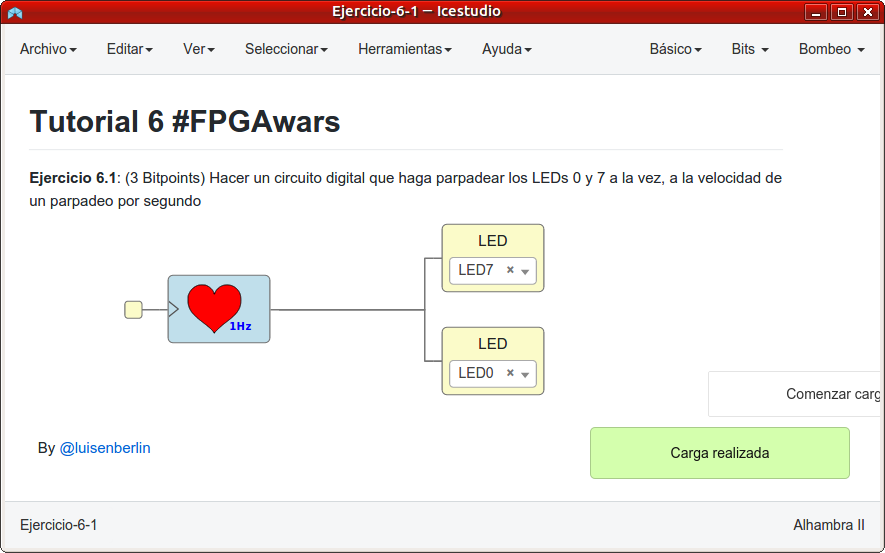
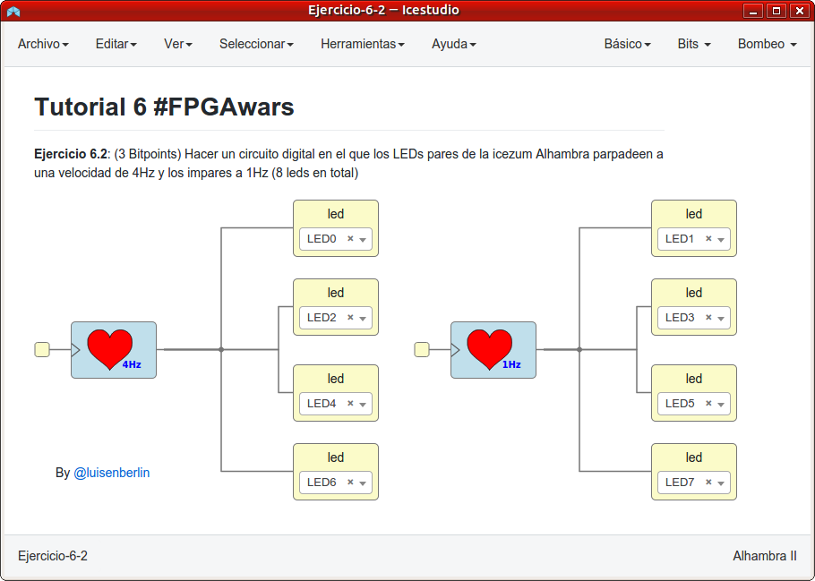
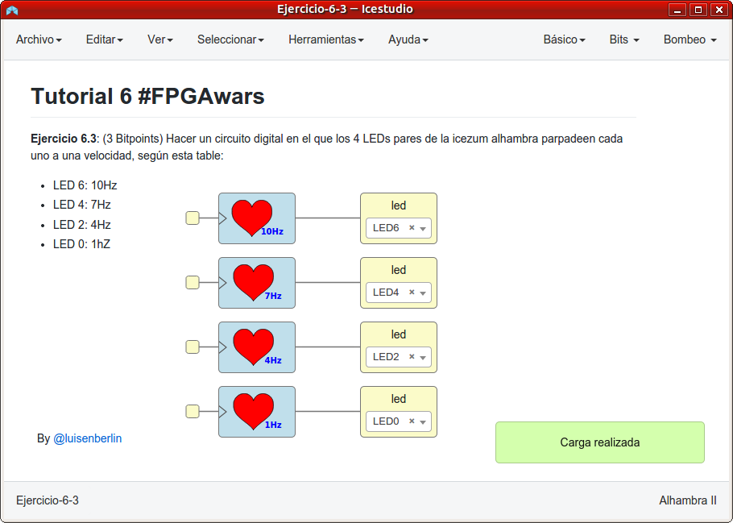
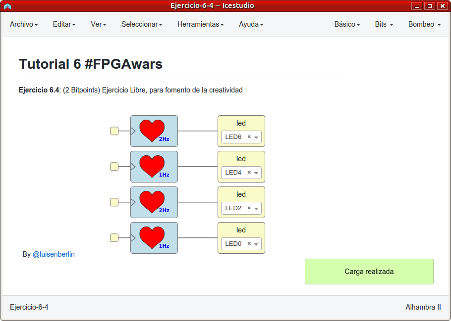

# Ejercicios propuestos del tutorial 6 #FPGAwars

Aquí dejo los ejercicios del tutorial 6

---

* **Ejercicio 1**: Hacer un circuito digital que haga parpadear los LEDs 0 y 7 a la vez, a la velocidad de un parpadeo por segundo.

| Circuito de Icestudio | Vídeo del diseño |
|--|--|
| |  |

---

* **Ejercicio 2**: Hacer un circuito digital en el que los LEDs pares de la icezum Alhambra parpadeen a una velocidad de 4Hz y los impares a 1Hz.

| Circuito de Icestudio | Vídeo del diseño |
|--|--|
| |  |

---

* **Ejercicio 3**: Hacer un circuito digital en el que los 4 LEDs pares de la icezum alhambra parpadeen cada uno a una velocidad, según esta tabla:
    - LED 6: 10Hz
    - LED 4: 7Hz
    - LED 2: 4Hz
    - LED 0: 1hZ

| Circuito de Icestudio | Vídeo del diseño |
|--|--|
| |  |

---

* **Ejercicio 4**: Ejercicio libre

Lo que he hecho es que vayan parpadeando alternativamente unos leds de forma que parece que avanzan o retroceden poco a poco.

| Circuito de Icestudio | Vídeo del diseño |
|--|--|
| |  |

---

By [@luisenberlin](http://twitter.com/luisenberlin)

