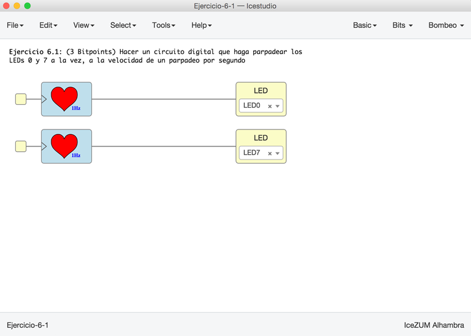
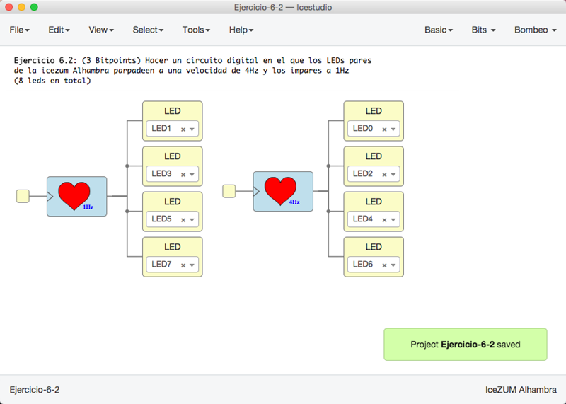
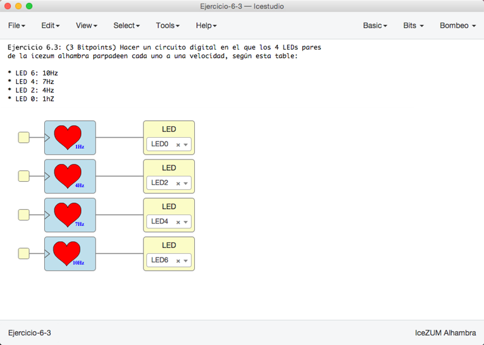

# Ejercicios propuestos (11 BitPoints)

* **Ejercicio 1** (Total **3 Bitpoints**): Hacer un circuito digital que haga parpadear los
LEDs 0 y 7 a la vez, a la velocidad de un parpadeo por segundo. **Entregar** por redes sociales, con mención a **@obijuan_cube**
  * 1 pantallazo del circuito (1 bitpoint)
  * 1 Vídeo del circuito funcionando (1 bitpoint)
  * Entrega adicional por Github (1 bitpoint) 

* **Ejercicio 2** (Total **3 Bitpoints**): Hacer un circuito digital en el que los LEDs pares
de la icezum Alhambra parpadeen a una velocidad de 4Hz y los impares a 1Hz. **Entregar** por redes sociales, con mención a **@obijuan_cube**
  * 1 pantallazo del circuito (1 bitpoint)
  * 1 Vídeo del circuito funcionando (1 bitpoint)
  * Entrega adicional por Github (1 bitpoint) 

* **Ejercicio 3** (Total **3 Bitpoints**): Hacer un circuito digital en el que los 4 LEDs pares 
de la icezum alhambra parpadeen cada uno a una velocidad, según esta tabla:
  * LED 6: 10Hz
  * LED 4: 7Hz
  * LED 2: 4Hz
  * LED 0: 1hZ

  **Entregar** por redes sociales, con mención a **@obijuan_cube**
  * 1 pantallazo del circuito (1 bitpoint)
  * 1 Vídeo del circuito funcionando (1 bitpoint)
  * Entrega adicional por Github (1 bitpoint) 

* **Ejercicio 4** (**2 Bitpoints**). Ejercicio Libre. Premiar la creatividad. **Entregar** por redes sociales o github: Pantallazos, enlaces, vídeos, etc...

***

***

<blockquote class="twitter-tweet" data-lang="es">
¡Ejercicios del Tutorial 6! Y a todo esto soy Cadete de Nivel 2... y subiendo... ??<a href="https://twitter.com/Obijuan_cube?ref_src=twsrc%5Etfw">@Obijuan_cube</a> <a href="https://twitter.com/hashtag/FPGAwars?src=hash&amp;ref_src=twsrc%5Etfw">#FPGAwars</a> <a href="https://t.co/qT9ag14sxb">pic.twitter.com/qT9ag14sxb</a>
&mdash; Migue (@migueabellan) <a href="https://twitter.com/migueabellan/status/952117762780028928?ref_src=twsrc%5Etfw">13 de enero de 2018</a></blockquote>
