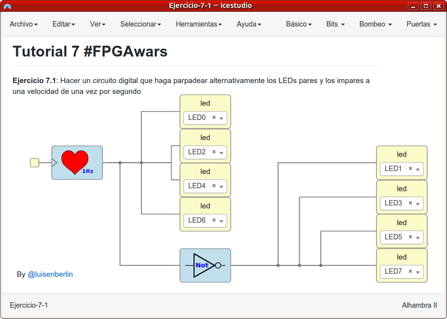
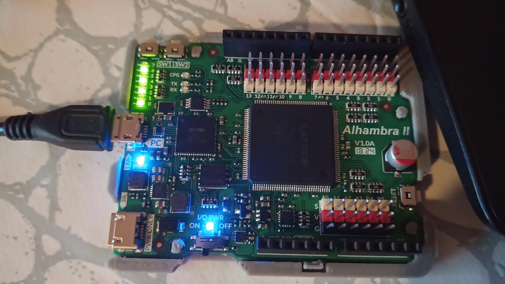
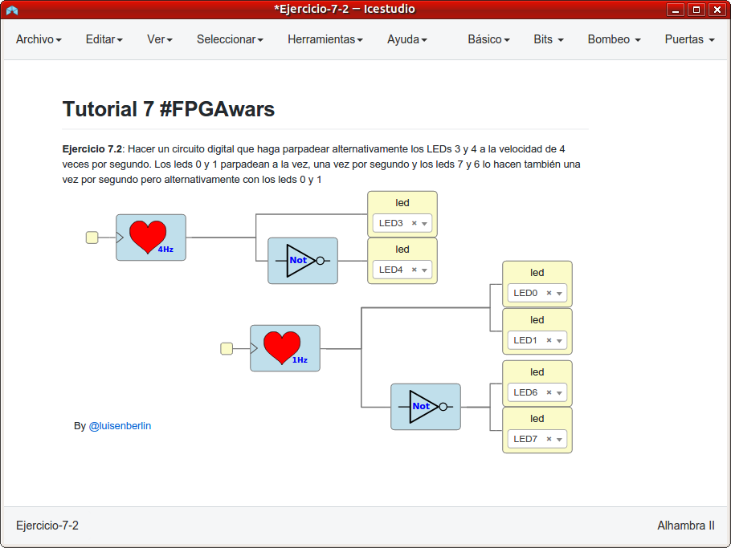
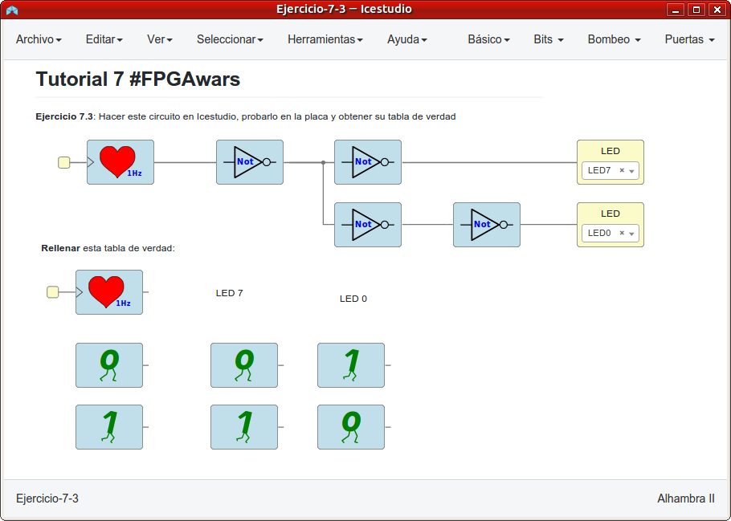

# Ejercicios propuestos del tutorial 7 #FPGAwars

Aquí dejo los ejercicios del tutorial 7.

---

* **Ejercicio 1**: Hacer un circuito digital que haga parpadear alternativamente los LEDs pares y los impares a una velocidad de una vez por segundo.
 

| Circuito de Icestudio | Vídeo del diseño |
|--|--|
| |  |

---

* **Ejercicio 2**: Hacer un circuito digital que haga parpadear alternativamente los LEDs 3 y 4 a la velocidad de 4 veces por segundo. Los leds 0 y 1 parpadean a la vez, una vez por segundo y los leds 7 y 6 lo hacen también una vez por segundo pero alternativamente con los leds 0 y 1.
 

| Circuito de Icestudio | Vídeo del diseño |
|--|--|
| |  |

---

* **Ejercicio 3**: Hacer el circuito indicado en el enunciado de la colección, probarlo en la placa y obtener su tabla de verdad.
 

| Circuito de Icestudio | Vídeo del diseño |
|--|--|
| |  |

---

* **Ejercicio 4**: Ejercicio libre

PENDIENTE
 

---

By [@luisenberlin](http://twitter.com/luisenberlin)

