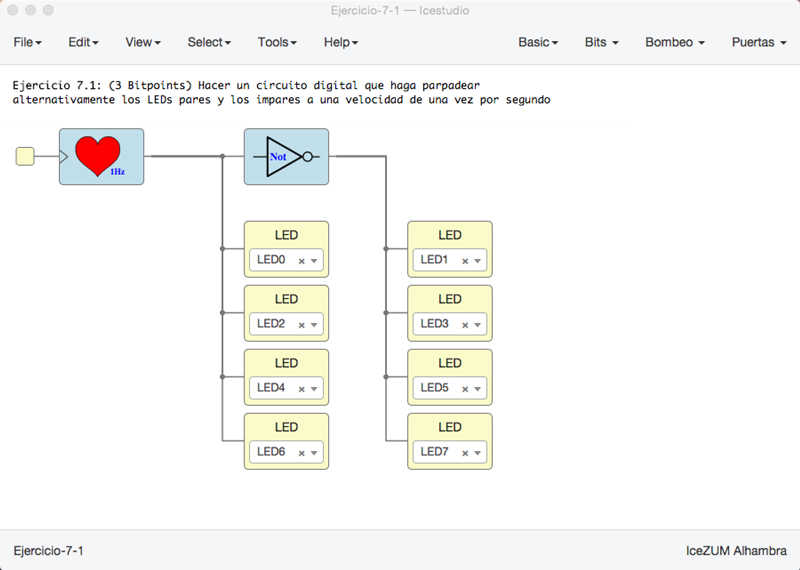
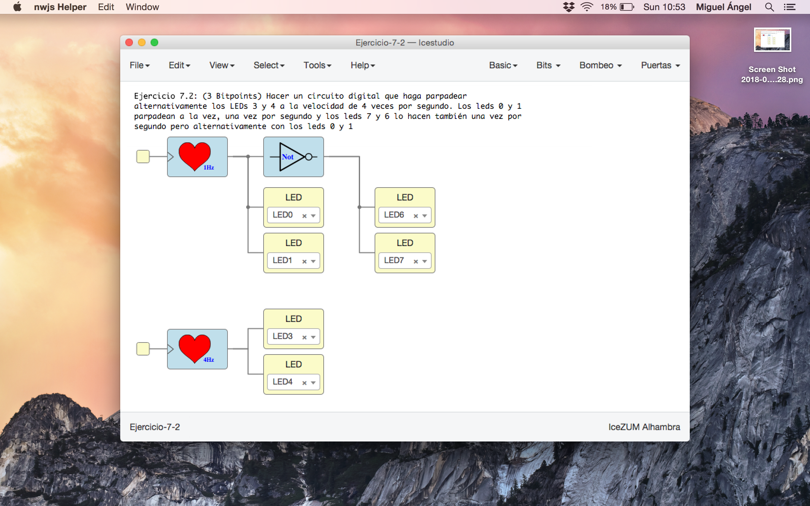
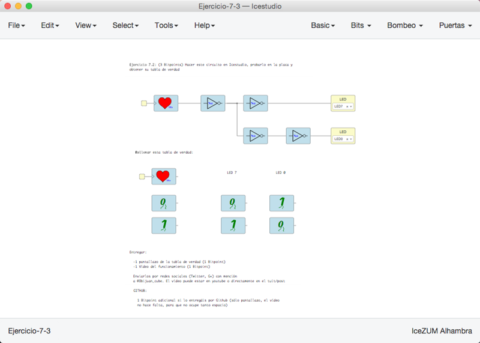

# Ejercicios propuestos (11 BitPoints)

Ver los detalles de los ejercicios y las entregas en el menú **Archivos/Ejemplos/2-Ejercicios** de la colección de este tutorial

**Resumen**:

* **Ejercicio 1** (Total **3 Bitpoints**): Hacer un circuito digital que haga parpadear
alternativamente los LEDs pares y los impares a una velocidad de una vez por segundo

* **Ejercicio 2** (Total **3 Bitpoints**): Hacer un circuito digital que haga parpadear
alternativamente los LEDs 3 y 4 a la velocidad de 4 veces por segundo. Los leds 0 y 1 
parpadean a la vez, una vez por segundo y los leds 7 y 6 lo hacen también una vez por
segundo pero alternativamente con los leds 0 y 1

* **Ejercicio 3** (Total **3 Bitpoints**): Hacer el circuito indicado en el enunciado de la colección, probarlo en la placa y obtener su tabla de verdad

* **Ejercicio 4** (**2 Bitpoints**). Ejercicio Libre. Premiar la creatividad. **Entregar** por redes sociales o github: Pantallazos, enlaces, vídeos, etc...

***

***

<blockquote class="twitter-tweet" data-lang="es">
¡Tutorial 7! ?? Ejercicios propuestos <a href="https://twitter.com/hashtag/FPGAwars?src=hash&amp;ref_src=twsrc%5Etfw">#FPGAwars</a><a href="https://twitter.com/Obijuan_cube?ref_src=twsrc%5Etfw">@Obijuan_cube</a> <a href="https://t.co/Wi6IYMD940">pic.twitter.com/Wi6IYMD940</a>
&mdash; Migue (@migueabellan) <a href="https://twitter.com/migueabellan/status/955025065430614016?ref_src=twsrc%5Etfw">21 de enero de 2018</a></blockquote>

