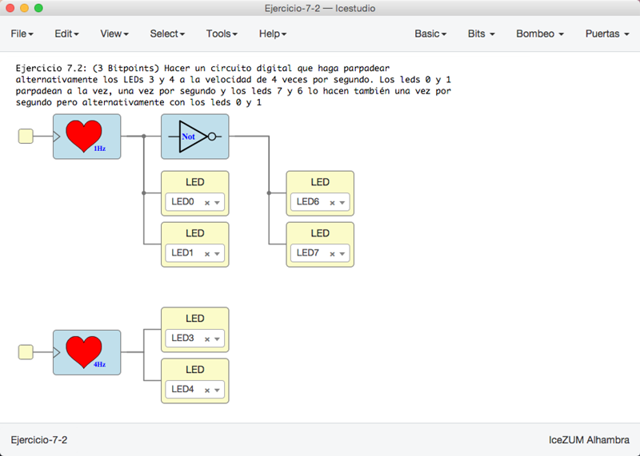

# Ejercicios propuestos (11 BitPoints)

Ver los detalles de los ejercicios y las entregas en el menú **Archivos/Ejemplos/2-Ejercicios** de la colección de este tutorial

**Resumen**:

* **Ejercicio 1** (Total **3 Bitpoints**): Hacer un circuito digital que haga parpadear
alternativamente los LEDs pares y los impares a una velocidad de una vez por segundo

* **Ejercicio 2** (Total **3 Bitpoints**): Hacer un circuito digital que haga parpadear
alternativamente los LEDs 3 y 4 a la velocidad de 4 veces por segundo. Los leds 0 y 1 
parpadean a la vez, una vez por segundo y los leds 7 y 6 lo hacen también una vez por
segundo pero alternativamente con los leds 0 y 1

* **Ejercicio 3** (Total **3 Bitpoints**): Hacer el circuito indicado en el enunciado de la colección, probarlo en la placa y obtener su tabla de verdad

* **Ejercicio 4** (**2 Bitpoints**). Ejercicio Libre. Premiar la creatividad. **Entregar** por redes sociales o github: Pantallazos, enlaces, vídeos, etc...

***

***

