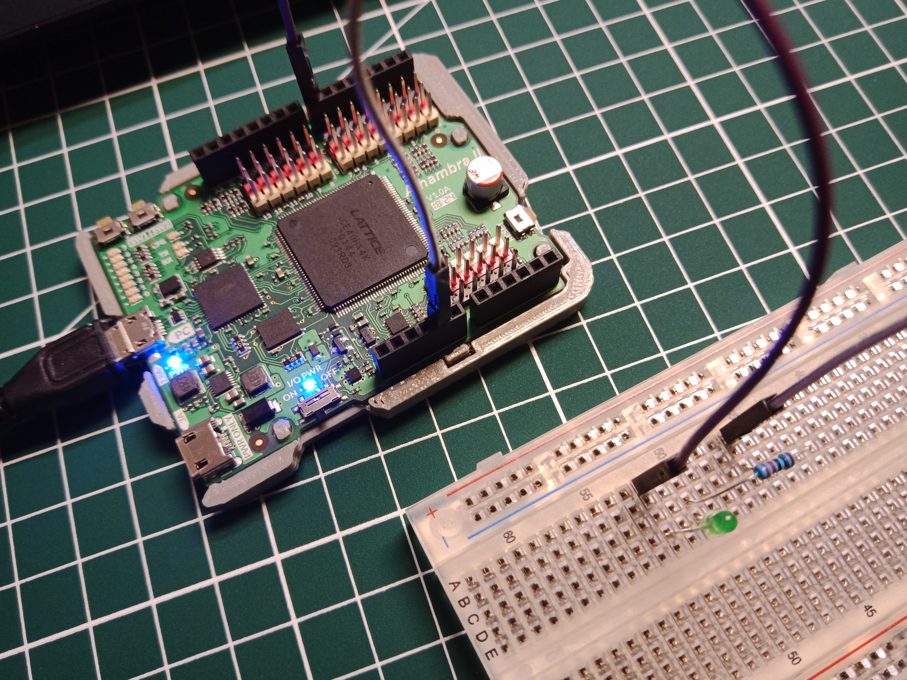
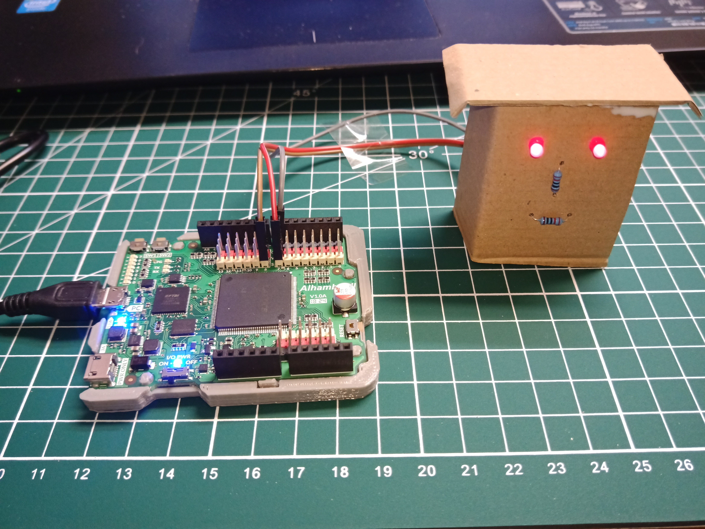
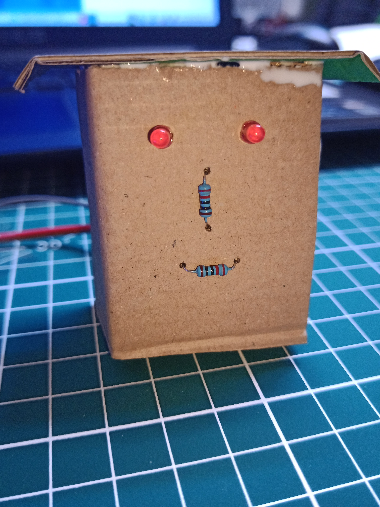
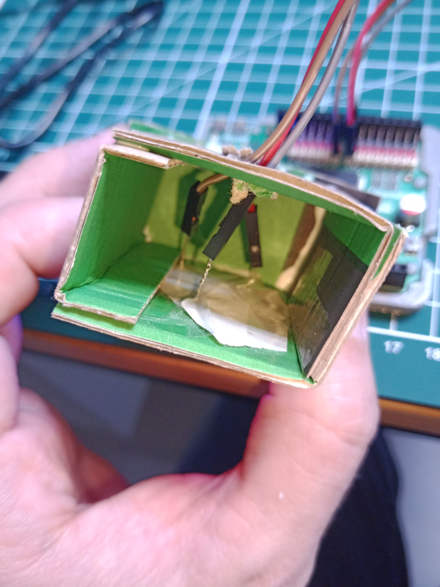
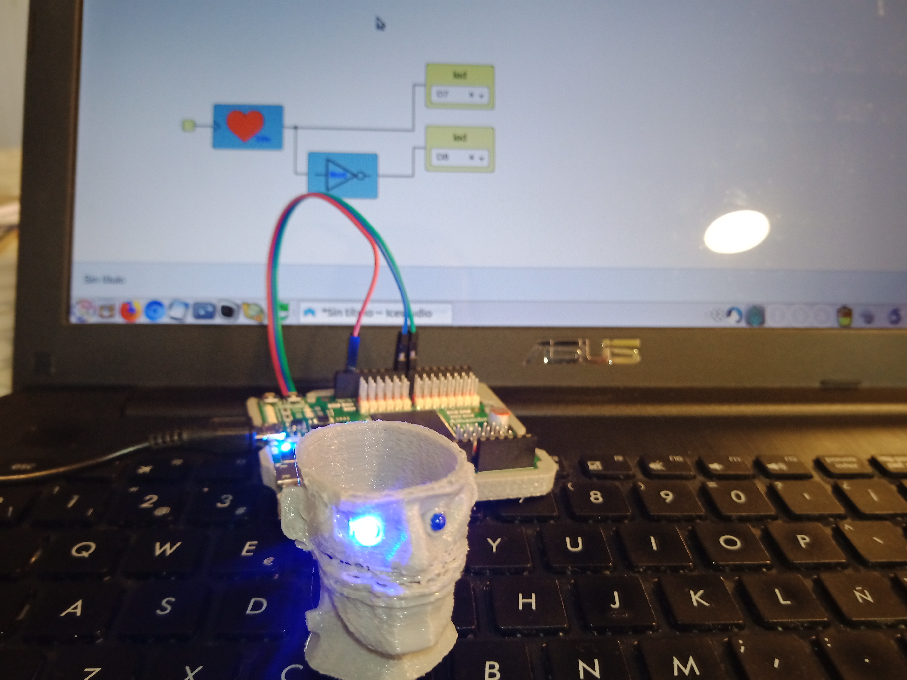
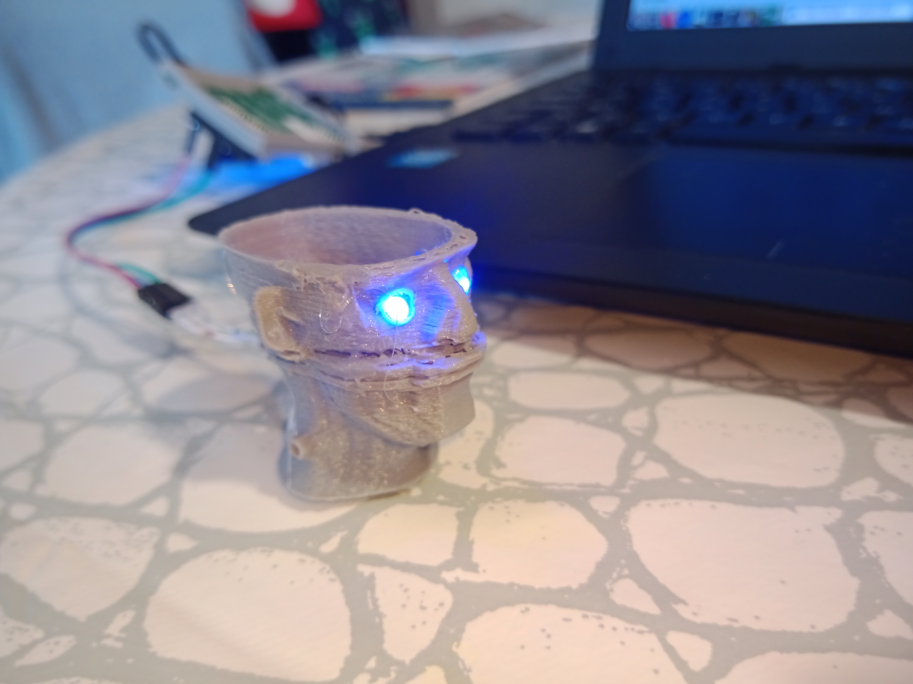
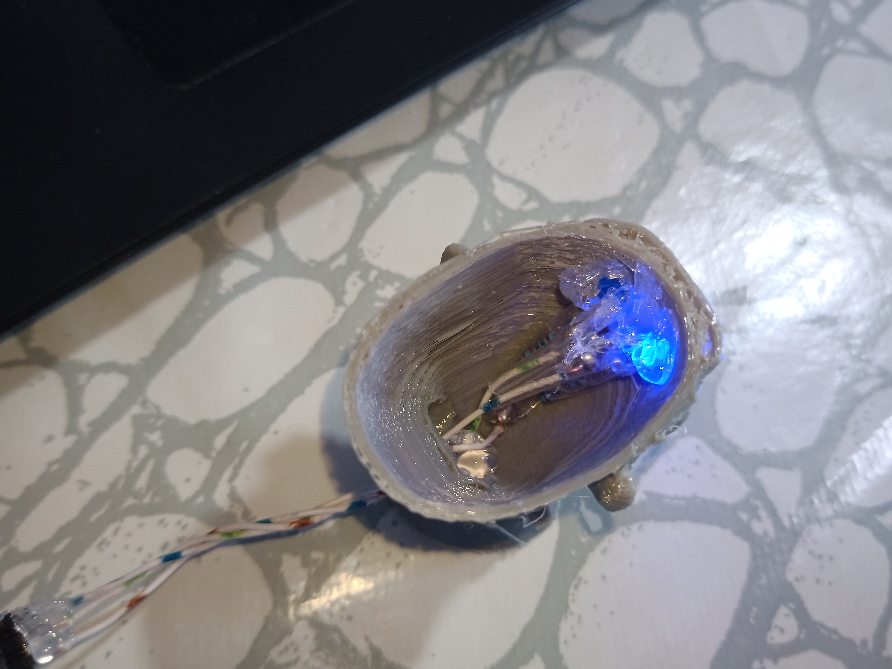

# Ejercicios propuestos del tutorial 8 #FPGAwars

Aquí dejo los ejercicios del tutorial 8.

---

* **Ejercicio 1**: Hacer un circuito digital que haga parpadear alternativamente dos LEDs externos, conectados en una protoboard, a la velocidad de 2Hz.
 

| Foto del circuito | Vídeo del diseño |
|--|--|
| |  |

---

* **Ejercicio 2**: Hacer un circuito digital para que los dos ojos de Franky parpadeen a la vez, a la velocidad de 4Hz. Es necesario construir a Franky.
 

| Foto de Franky funcionando | Vídeo del diseño |
|--|--|
| |  |
| Vista frontal de Franky | Vista de los cables internos de Franky |
|  |  |

---

* **Ejercicio 3**: Montar al menos una PCBprint con un led y conectarlo a la Icezum Alhambra. Hacer que parpadee a la frecuencia de 1Hz. Se concecerán bitpoints extras por montar y poner más de un PCBprint (hasta un máximo de 5 PCBprints). Si has puesto más de 1 LED, dividirlos en dos grupos y hacer que parpadeen alternativamente a 1Hz.
 

| Foto del circuito | Vídeo del diseño |
|--|--|
| |  |

---

* **Ejercicio 4**: Ejercicio libre: Franky impreso en 3D.

He diseñado a Franky en 3D y le he metido por ojos dos leds de color azul. El diseño es [un Frankenstein de Thingiverse](https://www.thingiverse.com/thing:1631820) que he impreso en 3D.

La impresión no ha salido del todo bien, porque no estaba bien calibrada la impresora, pero así le da mejor apariencia para ser un Frankenstein. Para pulir un poco las impurezas le he aplicado calor con el soldador.

Luego con el soldador he hecho los agujeros de los ojos y otro en la parte trasera para sacar los cables. Después he soldado los componentes de la misma forma que en el Franky de cartón. Y para que no se produzcan cortocircuitos, he separado un poco los cables con celo (*muy cutre, lo sé*) y pegado todo para que no se mueva con pegamento caliente.

Y el resulado lo podemos ver en estas imágenes y el vídeo.
 

| Foto de mi Franky | Otra foto de mi Franky |
|--|--|
| | |
| Otra foto más de mi Franky | Vídeo de Franky funcionando |
| |  |

 

---

By [@luisenberlin](http://twitter.com/luisenberlin)

