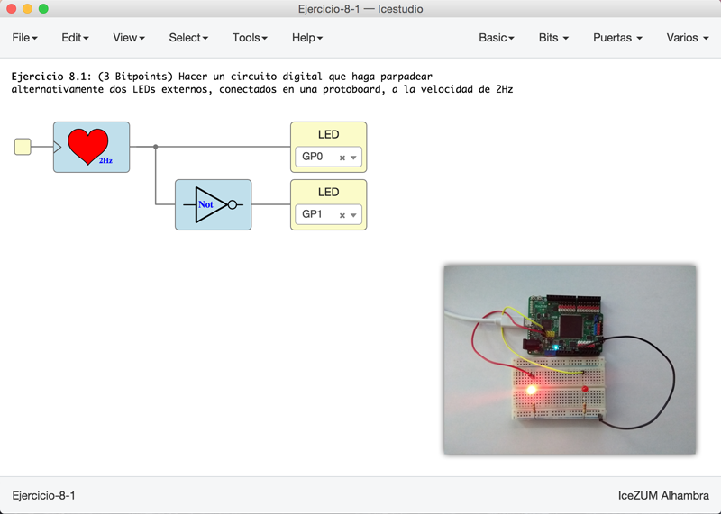
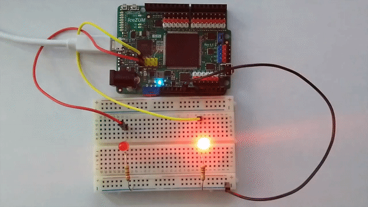
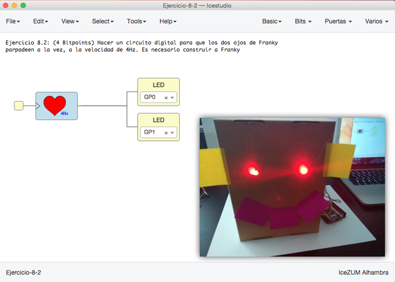
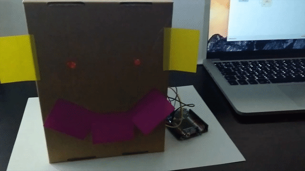

# Ejercicios propuestos (18 BitPoints)

Ver los detalles de los ejercicios y las **entregas** en el menú **Archivos/Ejemplos/2-Ejercicios** de la colección de este tutorial

**Resumen**:

* **Ejercicio 1** (Total **3 Bitpoints**): Hacer un circuito digital que haga parpadear
alternativamente dos LEDs externos, conectados en una protoboard, a la velocidad de 2Hz

* **Ejercicio 2** (Total **4 Bitpoints**): Hacer un circuito digital para que los dos ojos de Franky 
parpadeen a la vez, a la velocidad de 4Hz. Es necesario construir a **Franky**

* **Ejercicio 3** (Total **8 Bitpoints**): Montar al menos una **PCBprint** con un led y conectarlo a la
Icezum Alhambra. Hacer que parpadee a la frecuencia de 1Hz. Se concecerán bitpoints extras por
montar y poner más de un PCBprint (hasta un máximo de 5 PCBprints). Si has puesto más de 1 LED, 
dividirlos en dos grupos y hacer que parpadeen alternativamente a 1Hz

* **Ejercicio 4** (**3 Bitpoints**). Ejercicio Libre. Premiar la creatividad. **Entregar** por redes sociales o github: Pantallazos, enlaces, vídeos, etc...

***

***

<blockquote class="twitter-tweet" data-lang="es">
¡Tutorial 8! Mi Franky con Post-it como buen emprendedor ??<a href="https://twitter.com/Obijuan_cube?ref_src=twsrc%5Etfw">@Obijuan_cube</a> <a href="https://twitter.com/hashtag/FGPAwars?src=hash&amp;ref_src=twsrc%5Etfw">#FGPAwars</a> <a href="https://t.co/GrMZhgMDII">pic.twitter.com/GrMZhgMDII</a>
&mdash; Migue (@migueabellan) <a href="https://twitter.com/migueabellan/status/957611566228221952?ref_src=twsrc%5Etfw">28 de enero de 2018</a></blockquote>

