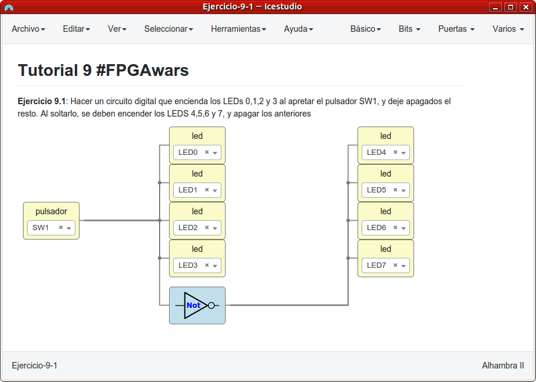
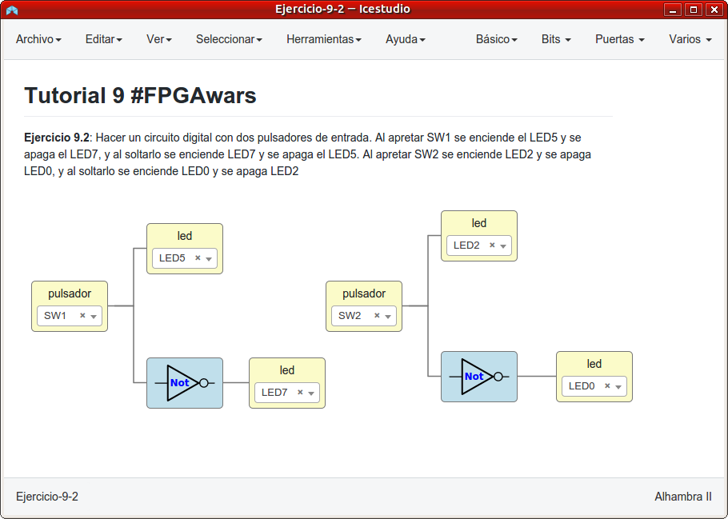
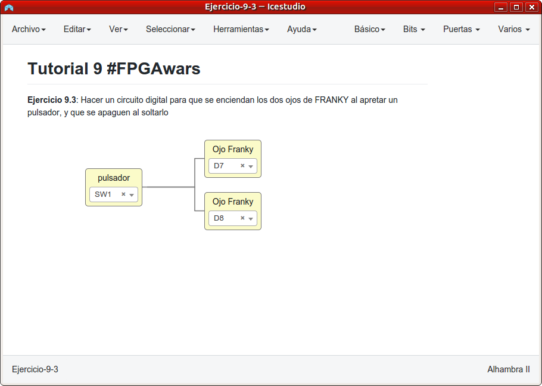
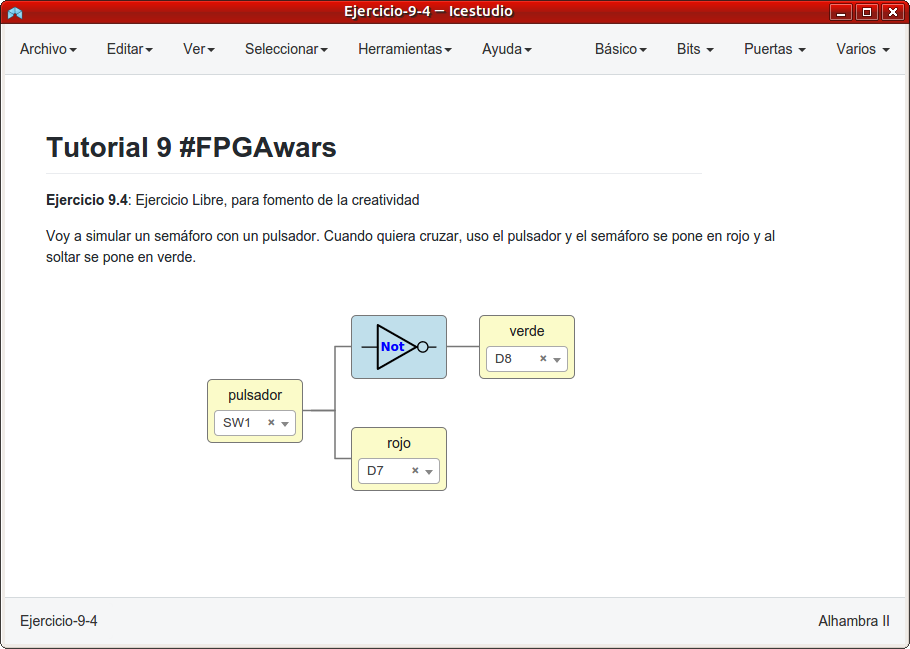

# Ejercicios propuestos del tutorial 9 #FPGAwars

Aquí dejo los ejercicios del tutorial 9.

---

* **Ejercicio 1**: Hacer un circuito digital que encienda los LEDs 0,1,2 y 3 al apretar el pulsador SW1, y deje apagados el resto. Al soltarlo, se deben encender los LEDS 4,5,6 y 7, y apagar los anteriores.
 

| Circuito de Icestudio | Vídeo del diseño |
|--|--|
| |  |

---

* **Ejercicio 2**: Hacer un circuito digital con dos pulsadores de entrada. Al apretar SW1 se enciende el LED5 y se apaga el LED7, y al soltarlo se enciende LED7 y se apaga el LED5. Al apretar SW2 se enciende LED2 y se apaga LED0, y al soltarlo se enciende LED0 y se apaga LED2.
 

| Circuito de Icestudio | Vídeo del diseño |
|--|--|
| |  |

---

* **Ejercicio 3**: Hacer un circuito digital para que se enciendan los dos ojos de FRANKY al apretar un pulsador, y que se apaguen al soltarlo.
 

| Circuito de Icestudio | Vídeo del diseño |
|--|--|
| |  |

---

* **Ejercicio 4**: Ejercicio libre

Voy a simular un semáforo con un pulsador. Cuando quiera cruzar, uso el pulsador y el semáforo se pone en rojo y al soltar se pone en verde.

 

| Circuito de Icestudio | Vídeo del diseño |
|--|--|
| |  |

---

By [@luisenberlin](http://twitter.com/luisenberlin)

