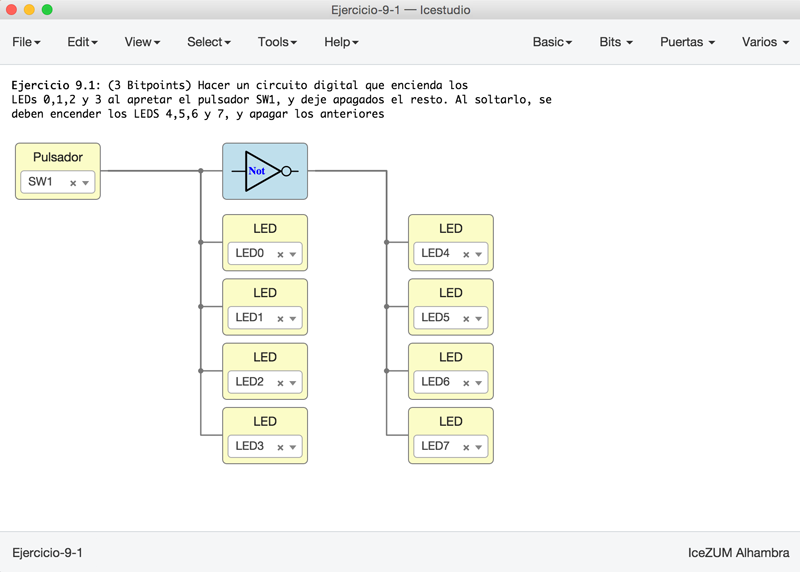
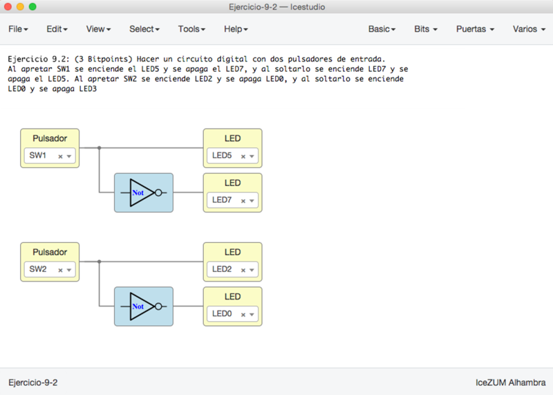
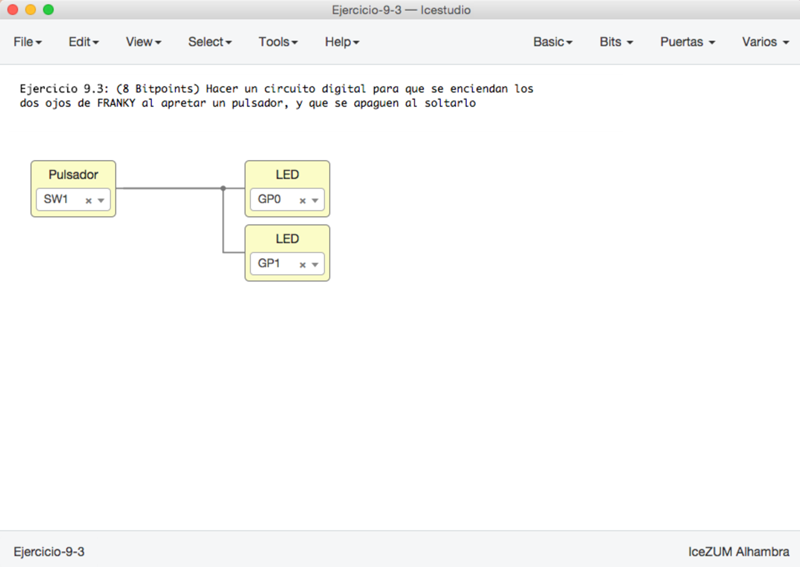
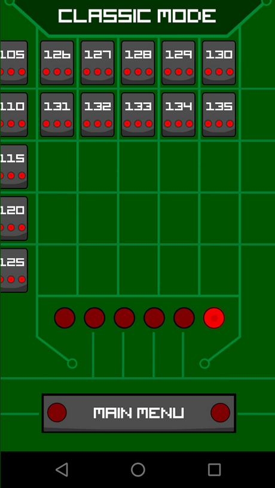

# Ejercicios propuestos (12 BitPoints + 2)

Ver los detalles de los ejercicios y las **entregas** en el menú **Archivos/Ejemplos/2-Ejercicios** de la colección de este tutorial

**Resumen**:

* **Ejercicio 1** (Total **3 Bitpoints**): Hacer un circuito digital que encienda los 
LEDs 0,1,2 y 3 al apretar el pulsador SW1, y deje apagados el resto. Al soltarlo, se 
deben encender los LEDS 4,5,6 y 7, y apagar los anteriores

* **Ejercicio 2** (Total **3 Bitpoints**): Hacer un circuito digital con dos pulsadores de entrada.
Al apretar SW1 se enciende el LED5 y se apaga el LED7, y al soltarlo se enciende LED7 y se 
apaga el LED5. Al apretar SW2 se enciende LED2 y se apaga LED0, y al soltarlo se enciende 
LED0 y se apaga LED2

* **Ejercicio 3** (Total **3 Bitpoints**): Hacer un circuito digital para que se enciendan los
dos ojos de FRANKY al apretar un pulsador, y que se apaguen al soltarlo

* **Ejercicio 4** (**3 Bitpoints**). Ejercicio Libre. Premiar la creatividad. **Entregar** por redes sociales o github: Pantallazos, enlaces, vídeos, etc...

***

***

